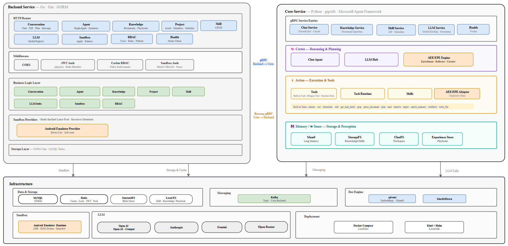
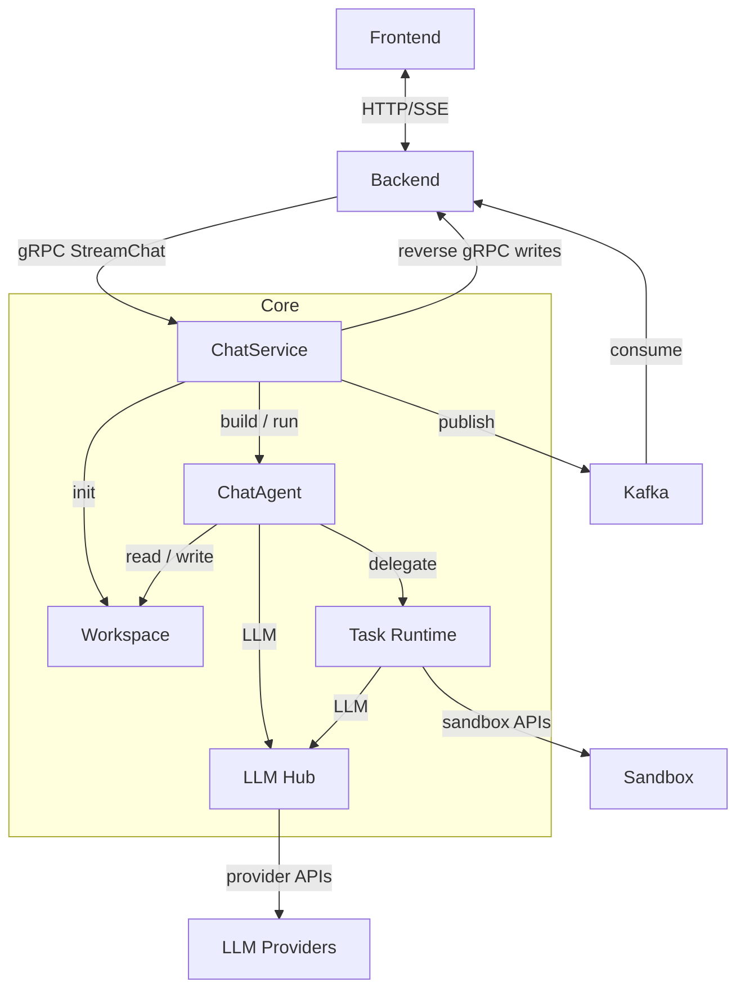
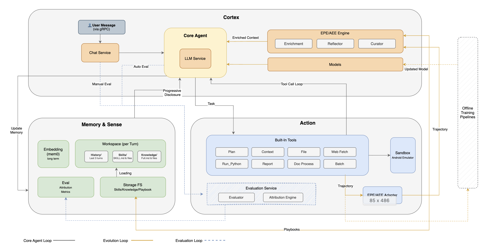
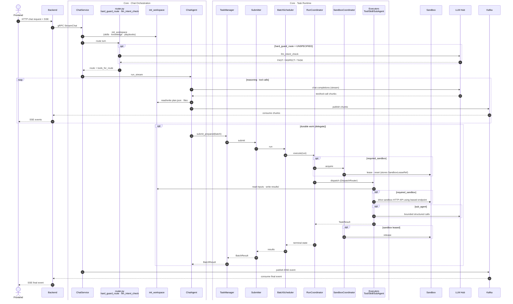

# Sico Technical Report (v0.2)

## Table of Contents

1. [Vision: Symbiotic Intelligence for Co-Evolution](#1-vision-symbiotic-intelligence-for-co-evolution)
   - [From Tools to Workforce](#11-from-tools-to-workforce)
   - [The Co-Evolution Loop](#12-the-co-evolution-loop)
2. [System Architecture](#2-system-architecture)
   - [Service Topology](#21-service-topology)
   - [Protobuf-Driven Development](#22-protobuf-driven-development)
   - [Authentication and Middleware](#23-authentication-and-middleware)
   - [Infrastructure Dependencies](#24-infrastructure-dependencies)
3. [Cortex-Action-Memory](#3-cortex-action-memory)
   - [Cortex: Reasoning and Planning](#31-cortex-reasoning-and-planning)
   - [Action: Skills, Tools, and Sandbox](#32-action-skills-tools-and-sandbox)
   - [Memory & Sense: Experience & Contextual Awareness](#33-memory--sense-experience--contextual-awareness)
   - [Three Loops at the Heart of Sico](#34-three-loops-at-the-heart-of-sico)
4. [Core Execution Loop](#4-core-execution-loop)
   - [End-to-End Flow](#41-end-to-end-flow)
   - [Workspace Initialization](#42-workspace-initialization)
   - [Route Classification (Intent Check)](#43-route-classification-intent-check)
   - [Agent Execution Loop](#44-agent-execution-loop)
   - [Planning](#45-planning)
   - [Tool Execution](#46-tool-execution)
   - [Delegated Task Runtime](#47-delegated-task-runtime)
   - [Sandbox: Observable Execution Environments](#48-sandbox-observable-execution-environments)
   - [Communication Mechanisms](#49-communication-mechanisms)
5. [Evolution Loop](#5-evolution-loop)
   - [Action & Memory/Sense Evolution (Training-Free)](#51-action--memorysense-evolution-training-free)
     - [Data Flow](#511-data-flow)
     - [Core Components](#512-core-components)
     - [Dual Feedback Paths](#513-dual-feedback-paths)
     - [Positioning](#514-positioning)
     - [External Agent Integration](#515-external-agent-integration)
   - [Cortex Evolution (Training-Based)](#52-cortex-evolution-training-based)
6. [Evaluation Loop](#6-evaluation-loop)
   - [Scope: Failure Attribution, Not Generic Scoring](#61-scope-failure-attribution-not-generic-scoring)
   - [The L1-L4 Taxonomy](#62-the-l1-l4-taxonomy)
   - [Closing the Loop](#63-closing-the-loop)
7. [Summary: The Co-Evolution Architecture](#7-summary-the-co-evolution-architecture)

---

## 1. Vision: Symbiotic Intelligence for Co-Evolution

### 1.1 From Tools to Workforce

Most AI assistants today remain at the "tool" stage: they can generate content, but they often cannot reliably drive tasks to validated outcomes, operate within accountable workflows, or improve through a sustained feedback loop. Sico reframes AI agents as Digital Workers: long-lived, structured capability units that can be managed, evaluated, and continuously improved through real work.

- **Digital Workers** execute repeatable tasks with increasing reliability and consistency.
- **Humans (Operators)** set goals, evaluate outcomes, and provide corrections.
- System distills these corrections and task-level signals into **two complementary forms of improvement**: reusable execution experience (strategies, playbooks, memories) that takes effect on the next run, and structured training data that feeds back into the base model so the worker's intrinsic capability grows over longer cycles.

### 1.2 The Co-Evolution Loop

A Digital Worker's capabilities improve along **two complementary tracks**, both driven by real-world execution and Operator guidance:

- **Training-free evolution**: This track accumulates reusable strategies, playbooks, and memories *around* the model. These improvements can take effect within the current session or in subsequent executions.
- **Training-based evolution**: This track converts execution outcomes, Operator corrections, and task trajectories into high-quality training data for SFT/RL pipelines, enabling the base model to improve over longer cycles.

```text
  Operator                                    Digital Worker
     │                                             │
     │── set goal ──────────────────────────────>  │
     │                                             │── execute (traced)
     │                                             │── produce outcomes
     │ <── request intervention (when uncertain) ─ │
     │── provide corrections ──────────────────>   │
     │                                             │
     │         ┌──────────────────────────────┐    │
     │         │      Experience Store        │    │
     │         │  trajectories, corrections,  │<───│
     │         │  outcomes, strategies        │    │
     │         └──────────────┬───────────────┘    │
     │                        │                    │
     │           training-free feedback            │
     │                        │  retrieve & apply  │
     │                        ├───────────────────>│  (enriched context,
     │                        │                    │   updated strategies)
     │           training-based feedback           │
     │                        │  SFT / RL          │
     │                        └───────────────────>│  stronger base model
     │                                             │
     │  <── improved capability ───────────────────│
```

Each task execution generates signals about effective strategies, failed steps, and environment responses. Sico routes these signals into **two feedback loops**: a training-free loop that distills them into reusable experience the Digital Worker can retrieve and apply in future executions ([§5.1](#51-action--memorysense-evolution-training-free)), and a training-based loop that converts them into high-quality training data for improving the base model through SFT/RL ([§5.2](#52-cortex-evolution-training-based)). Together, these loops reduce repeated errors in the short term while raising baseline competence over the long term.

As execution quality improves, the need for repetitive Operator intervention is expected to decrease. Prior human corrections are incorporated into both the worker's strategy selection process and the model improvement pipeline. Over time, Operator judgment continuously shapes worker behavior, while Digital Workers become increasingly capable of handling routine execution with less supervision.


---

## 2. System Architecture

### 2.1 Service Topology
Sico separates user-facing serving, Core orchestration, and delegated execution into clear ownership boundaries. The **Backend** owns HTTP/SSE ingress, authentication, and primary persistence. **Core** owns turn orchestration, workspace state, LLM/tool coordination, and Task Runtime execution. Sandboxes are leased per run only when isolated execution is needed. The static topology diagram shows deployed service boundaries; the runtime topology below simplifies the chat execution path.



At runtime, the frontend sends the chat request and receives the SSE stream over HTTP. Deployments may proxy this traffic before Backend, but the simplified diagram treats it as a Frontend-Backend link. Backend invokes Core's `StreamChat` gRPC endpoint to start the turn, while user-visible streaming is decoupled through Kafka and SSE. Core writes platform-owned state through reverse gRPC; [§4.9](#49-communication-mechanisms) expands the exact services. Inside Core, `ChatService` initializes the workspace, routes the request, and runs `ChatAgent`; delegated work enters Task Runtime and may call the LLM Hub or leased sandbox APIs. The detailed per-turn sequence is expanded in [§4.1](#41-end-to-end-flow).



The `Workspace` provides shared execution state for a turn. Initialization materializes skills, knowledge, playbooks, and attachments before routing ([§4.2](#42-workspace-initialization)); `ChatAgent` writes plans and intermediate artifacts during reasoning; delegated batches publish outputs under `results/` for later steps to consume. This keeps cross-component coordination file-based and auditable, while platform persistence remains centralized behind Backend reverse gRPC services.

### 2.2 Protobuf-Driven Development

All cross-service contracts are defined in `proto/` and generated to four targets:

| Target | Generator | Output |
|--------|-----------|--------|
| Go gRPC stubs | `protoc` | `backend/internal/transport/grpc/pb/` |
| Go HTTP DTOs | `protoc` + `protoc-go-inject-tag` | `backend/internal/transport/http/dto/` |
| Go reverse gRPC | `protoc` | `backend/internal/transport/reverse_grpc/pb/` |
| Python stubs | `betterproto2` | `core/app/pb/` |

### 2.3 Authentication and Middleware

Backend serves two kinds of callers: human Operators using the web client and machine clients running inside Sandboxes. The two audiences use different middleware stacks:

| Audience | Mechanism | Replay protection |
|----------|-----------|-------------------|
| Users (web client -> operator-facing management API) | JWT (HS512) + Casbin RBAC | JWT token store (Redis when `REDIS_HOST` is set, else in-process cache), invalidated on logout via `JWTAuth.DestroyToken` |
| Sandbox clients (machine → API) | HMAC-SHA256 with `X-Sico-*` headers, per-client secret from `SANDBOX_CLIENT_SECRET_<CLIENT_ID>` | Redis nonce store |

The JWT middleware applies to user-facing APIs, with a small whitelist for login, health, and public LLM runtime routes. Sandbox client endpoints (`/api/sico/sandbox/apply`, `/release`) use HMAC-SHA256 instead of JWT; secrets are compared with `hmac.Equal`.

### 2.4 Infrastructure Dependencies

All stateful systems below are provisioned automatically by `make compose-up` or `make kind-up`:

| Dependency | Role |
|------------|------|
| **MySQL** | Primary store (GORM), schema managed by `golang-migrate`, auto-applied at startup. |
| **Redis** | Cache, distributed locks, JWT blacklist, sandbox lease pool, sandbox nonce store. |
| **Qdrant** | Vector store for Mem0-backed long-term memory. |
| **Kafka** | Event bus for Core → Backend streaming chunks (decouples gRPC from SSE). |
| **SeaweedFS** | Blob storage for uploads, artifacts, and workspace assets. |
| **Nginx** | Single reverse-proxy entry point in front of Frontend and Backend. |
| **LLM providers** | OpenAI, Azure, Anthropic, Gemini, OpenRouter, etc., accessed via the LLM Hub ([§3.1](#31-cortex-reasoning-and-planning)). |

Core never connects to MySQL directly. Primary relational persistence is mediated by Backend through reverse gRPC, while Core keeps execution artifacts and memory-related state in workspace files, local stores, and Mem0/Qdrant-backed memory. This keeps the primary data model centralized in Backend without requiring Core to own schema migrations.

---

## 3. Cortex-Action-Memory

A Digital Worker is not a single prompt or a model wrapper. It is a structured capability unit with three layers:

```
┌───────────────────────────────────────────────────────────┐
│                      Digital Worker                       │
├──────────────┬──────────────────┬─────────────────────────┤
│    Cortex    │      Action      │    Memory & Sense       │
│  Reasoning   │   Skills, tools, │  Project knowledge,     │
│  & planning  │   sandbox envs   │  execution experience   │
└──────────────┴──────────────────┴─────────────────────────┘
```

### 3.1 Cortex: Reasoning and Planning

All LLM traffic flows through the **LLM Hub** (`core/app/llmhubs/`), a unified runtime with adapters for multiple providers:

- **Model resolution**: built-in models are loaded from Core YAML configs; for DB-sourced custom models, Backend resolves the model per request and passes a `RuntimeModelDefinition` (including decrypted secrets) alongside the gRPC call, so the current main path does not require Backend DB models to be globally registered in Core
- **Adapter pattern**: selects the right adapter based on `provider_template_type` from six implementations. Four target specific vendor protocols (Azure OpenAI, OpenAI-compatible, Anthropic, Gemini); two are generic, config-driven adapters (HTTP-JSON, HTTP-binary) that let an operator wire an arbitrary HTTP model endpoint into the hub purely through field mapping and JSONPath extraction, with HTTP-binary streaming returned artifacts (images, audio) to blob storage.
- **ChatClient**: bridges the Microsoft Agent Framework's `BaseChatClient` interface to LLMHub, handling tool calls, image input, streaming, and reasoning effort control

The agent execution loop (`ChatAgent.run_stream()`) builds on top of ChatClient: `ChatClient` handles LLM communication, while `ChatAgent` orchestrates the full execution cycle (workspace setup, tool binding, streaming, and cleanup). ChatAgent leverages the Agent Framework's `FunctionInvocationLayer` for automatic tool call orchestration: the LLM outputs a function call -> the Framework executes it -> the result is injected back -> the LLM continues. This enables multi-step reasoning with tool use in a single streaming pass.

**Planning** is implemented through autonomous LLM tool calls, not hard-coded workflows. The LLM uses three plan tools (`plan_read`, `plan_write`, `plan_tool_call_message_update`) to create and manage execution plans in real time. Plans support cancellation (via marker files polled every 2 seconds) and status tracking (`pending`, `in_progress`, `completed`, `failed`, `require_human_input`).

### 3.2 Action: Skills, Tools, and Sandbox

#### Built-in Tools

Core defines a set of 16 built-in tools. Rather than handing the whole set to every turn, the chat agent receives a **route-scoped** subset (`fast` / `inspect` / `task`); role-level differentiation comes from skills, knowledge, playbooks, and runtime context (workspace, plan, sandbox session) on top of that shared definition (the route is decided by the intent check in [§4.3](#43-route-classification-intent-check), and route gating lives in `core/app/biz/chat/router.py`; see [§4.6](#46-tool-execution)):

| Category | Tools |
|----------|-------|
| **Workspace context** | `context` |
| **File I/O** | `read`, `write_file`, `edit`, `grep`, `remove` |
| **HTTP & web** | `webfetch`, `curl`, `download` |
| **Document parsing** | `parse_document` |
| **Planning** | `plan_read`, `plan_write`, `plan_tool_call_message_update` |
| **Memory** | `search_memory` |
| **Reporting** | `report` |
| **Task inspection** | `get_task_detail` |

Durable "real work" (running commands, driving sandboxes, executing skills) is intentionally **not** a built-in tool. It is funneled through a single `delegate` tool added to the `task` route, which hands the work to the Delegated Task Runtime ([§4.7](#47-delegated-task-runtime)). `curl` is dual-purpose: the agent uses it for arbitrary HTTP fetches, while sandbox HTTP APIs are driven by the task runtime, not by the chat agent directly.

#### Skills

A **Skill** is a packaged capability defined by a `SKILL.md` file (YAML frontmatter + Markdown) plus optional runtime scripts and config. Skills can be scoped to a project (shared by all agents) or to a specific agent.

Sico compiles skills **ahead of time** rather than re-interpreting `SKILL.md` at runtime. When a skill is uploaded or updated, the backend calls Core to run the **Skill Resolver** ([§3.2 → Skill Resolver](#skill-resolver-build-time-compilation)), an LLM pass that compiles the human-written skill into two artifacts:

- `resolved/cortex/` : the agent-facing reference files (the `SKILL.md` and any docs/schemas it points to), copied into the workspace for the LLM to read.
- `resolved/actions.json` : a deterministic, executable action manifest (argv steps with typed parameters and placeholders) that the task runtime executes with **zero LLM calls** at run time.

At the start of each chat, workspace initialization copies the resolved cortex files for all relevant skills into the agent's working directory and generates an `index.json`. The skill list is appended to the user message, and the LLM autonomously decides which skills to read and, when execution is needed, dispatches them through `delegate`.

#### Skill Resolver (build-time compilation)

The Skill Resolver (`core/app/biz/skill/resolver.py`) is what makes skills cheap and reproducible at run time: a skill author writes a normal `SKILL.md`, and the resolver compiles it **once, at upload time**, into the `actions.json` manifest described above. The design has four notable properties:

- **Zero-LLM runtime.** The expensive interpretation (what to run, in what order, with which parameters) happens once during the build-time LLM pass. At run time the task runtime only reads `actions.json` and executes argv steps, so skill execution is deterministic, fast, and auditable.
- **Structured, validated output.** The resolver emits a Pydantic-validated `ResolvedSkillOutput` (`cortex` + `actions`), where each action carries `infra_requirements` (e.g. `sandbox.android`, `sandbox.windows`), typed `parameters`, and `steps` (`argv` with built-in placeholders like `{workspace_dir}`, `{result_dir}` and sandbox placeholders such as `{sandbox.android}`). Invalid output is retried with the error fed back into the prompt, up to 3 attempts (`_MAX_RESOLVER_ATTEMPTS`); on persistent failure it falls back to a cortex-only skill with no actions.
- **Incremental re-resolution.** On re-upload the resolver diffs the previous and current skill files (budgeted to `_MAX_TOTAL_DIFF_BYTES`) and passes the diff plus the previous `actions.json` into the prompt, so unchanged skills reuse prior output and changed skills are adapted incrementally instead of recompiled from scratch.
- **Versioned persistence.** The backend `skill` domain stores each resolution as a new `SkillVersionModel` row, so skill definitions are versioned and a current version is always resolvable.

At run time, `SkillLoader` (`core/app/biz/task_runtime/skill_loader.py`) projects each resolved action into a **CapabilityCard** (name, parameters, infra requirements, visibility). These cards are the shared catalogue that every skill consumer chooses from when turning an instruction into a concrete skill dispatch — whether an LLM planner (e.g. the `general` adapter, the sub-agent loop in [§4.7](#47-delegated-task-runtime)) or a deterministic adapter that matches cards by rule (e.g. the `workbook` adapter).

#### Sandbox Environments

Sandbox capabilities are exposed as HTTP APIs on each sandbox instance. The chat agent never acquires or drives a sandbox directly; instead, when a delegated task declares a `required_sandbox`, the task runtime's `SandboxCoordinator` leases one sandbox for that run and drives its HTTP API (tap, install, reset, …), so the sandbox runtime only needs to ship its HTTP server, not per-endpoint agent-side wrappers. See [§4.7](#47-delegated-task-runtime) and [§4.8](#48-sandbox-observable-execution-environments) for details.

### 3.3 Memory & Sense: Experience & Contextual Awareness

A Digital Worker needs different kinds of memory at very different time scales. Rather than putting everything into a single vector store, Sico splits memory into five layers, each backed by the storage that best fits its access pattern.

| Memory Type | Mechanism | Scope | Storage |
|-------------|-----------|-------|---------|
| **Short-term (in-turn)** | LLM context window + plan scratchpad | Current task | LLM context + local FS (`plan.json`) |
| **Recent history** | Last 3 turns of `conversation.json` (text-only), prepended to the prompt | Same `(user, agent_instance)` | Local FS (`CHAT_FS`) |
| **Long-term** | Mem0 facts extracted per turn, retrieved on demand by `search_memory` | Cross-session, per `(user, agent_instance)` | Qdrant vector store |
| **Project knowledge** | Knowledge bases and workspace files parsed with MarkItDown, then materialized into the agent workspace | Shared within a project or scoped to an agent | Local FS / object storage |
| **Execution experience** | Playbooks produced by the Reflector → Curator pipeline ([§5.1](#51-action--memorysense-evolution-training-free)) | Per `(project, agent_instance)` | Local FS + Backend knowledge service |

#### Memory hierarchy

```
   time scale             layer                            who decides what to load
   ──────────────         ─────────────────────            ────────────────────────
   this LLM call    ───►  in-turn context window     ◄──   ChatAgent (always)
                          + plan.json scratchpad

   last few turns   ───►  recent 3 turns (text-only) ◄──   ChatAgent (always)
                          conversation.json files

   cross-session    ───►  Mem0 / Qdrant facts        ◄──   LLM (calls search_memory)
                          keyed by (user, agent)

   per-task setup   ───►  workspace skills/knowledge ◄──   workspace_init + LLM read
                          + playbook (§5.1)

```

#### Long-term memory: Mem0 + Qdrant

Long-term memory is the only memory layer backed by a vector database. It uses [Mem0](https://docs.mem0.ai/) as the orchestration layer, with **Qdrant** as the vector store. In the default deployment config, Azure OpenAI serves as both the embedder (`text-embedding-3-small`, 1536-dim) and the fact-extraction LLM, both are swappable via `mem0_config.yaml`. The flow is:

```
chat turn ends
  └─► _enqueue_memories(user_message, assistant_message)
        └─► AsyncJobRunner (background worker pool, non-blocking)
              └─► Mem0.add(messages, user_id, agent_id)
                    ├─ extraction LLM: distill atomic facts
                    ├─ embedder: encode each fact
                    ├─ Qdrant: upsert (vector, payload{user_id, agent_id, ...})
                    └─ internal LLM: decide ADD vs UPDATE vs NOOP
```

Two design choices matter:

- **Write is fully asynchronous.** Memory writes go through `AsyncJobRunner` (a 16-worker `asyncio` pool). If Mem0 / Qdrant / the extraction LLM is slow or unavailable, the user-facing SSE stream is **unaffected**: at worst, this turn's memory write is lost.
- **Read is on-demand, not auto-injected.** Memory is **not** stuffed into the system prompt every turn. Instead, the LLM autonomously decides when to call the built-in `search_memory` tool. The tool runs a similarity search in Qdrant filtered by `(user_id, agent_id)` (default `threshold=0.5`, `top_k=5`) and returns the matching facts to the LLM. Each call is recorded as a `tool_call` on the plan, so Operators can see *what* the agent recalled and *when*.

This RAG-style "pull" model trades a little recall reliability (the LLM may forget to query) for a large gain in context cleanliness: long sessions do not get polluted by unrelated old memories.

#### Memory vs. Playbook

These two are easy to confuse but have **disjoint responsibilities**:

| | Long-term memory (Mem0) | Playbook (Experience Learning) |
|---|---|---|
| Stores | User/conversation **facts** ("user is in Shanghai timezone") | Execution **strategies** ("for task X, prefer approach Y") |
| Produced by | Mem0 extraction on every turn | Reflector → Curator after task completion |
| Isolation | `(user, agent_instance)` | `(project, agent_instance)` |
| Injection | LLM calls `search_memory` on demand | Rendered as Markdown files in the agent workspace, optionally fused into user message |
| Quality signal | None | `helpful` / `harmful` citation counts |

Memory remembers **who the user is and what was said**; the Playbook remembers **how to do this kind of work**.

#### Document parsing: feeding heterogeneous sources into the workspace

Both the **project knowledge** layer and the `parse_document` built-in tool ([§4.6](#46-tool-execution)) share one ingestion path: a `DocExtractor` (`core/app/document/`). The abstract interface (`base.py`) exposes `extract(file_path)` and `extract_from_url(url)`, each returning a `(full_text, summary)` pair; the default `extract_from_url` downloads a SAS/HTTP source to a temp file and delegates to `extract`. The shipped implementation (`MarkitdownDocExtractor`, `markitdown.py`) uses the open-source **MarkItDown** library to convert heterogeneous formats (PDF, Word, Excel, etc.) into Markdown, then runs a single capped LLM call (input truncated to 50K chars, summary ≤1024 tokens) to produce the summary, degrading to an empty summary if that call fails. This is what turns uploaded knowledge bases and ad-hoc attachments into the plain-text workspace files the agent can `read`.

### 3.4 Three Loops at the Heart of Sico

Cortex, Action, and Memory are the static anatomy of a Digital Worker. What makes the worker *alive* is the way these three layers are wired into **three running loops** - and these loops are the actual core of Sico.




| Loop | Section | What it does | What it consumes / produces |
|------|---------|--------------|------------------------------|
| **Execution Loop** | [§4](#4-core-execution-loop) | Turn an Operator goal into traced agent execution | Goal -> trajectory + outcome |
| **Evolution Loop** | [§5](#5-evolution-loop) | Train the Cortex and distill trajectories into reusable strategies | Outcomes -> training signals / Playbook -> stronger next run |
| **Evaluation Loop** | [§6](#6-evaluation-loop) | Attribute *why* a task failed *(planned, not yet shipped)* | Failed trajectory -> L1–L4 verdict -> input back into Evolution |

#### Mapping to *Symbiotic Intelligence for Co-Evolution*

The three loops are exactly the operational form of the vision in [§1](#1-vision-symbiotic-intelligence-for-co-evolution):

- **Execution Loop** represents the runtime layer where Digital Workers perform tasks. The Operator specifies the goal, and the Cortex-Action-Memory stack executes with workspace tools, delegated task-runtime runs, and, when a run declares `required_sandbox`, an observable Sandbox. This loop generates structured execution traces, including actions, intermediate states, tool outputs, and environmental feedback.
- **Evolution Loop** converts execution traces into reusable capability. Successful strategies and recurring failure patterns are extracted from prior runs and incorporated into the worker's future prompt context. In this way, capability accumulation happens at the platform layer, rather than relying only on model-weight updates.
- **Evaluation Loop** provides the governance and improvement mechanism. Failure attribution classifies errors into categories such as Task Instruction Issue, Digital Worker (DW) Capability Issue, and Environment Issue. These structured signals help the Operator determine the appropriate correction and provide targeted input for the Evolution Loops.

Together, the three loops form a continuous improvement cycle: Execution produces experience, Evolution converts experience into reusable capability, and Evaluation identifies where the worker or the environment should be improved. When applied repeatedly to the same Digital Worker, this cycle enables co-evolution between the Operator and the Digital Worker.

---

## 4. Core Execution Loop

Chat is where Operator intent meets Digital Worker execution. It coordinates four communication mechanisms (gRPC, reverse gRPC, Kafka, SSE) and orchestrates workspace setup, agent reasoning, tool execution, planning, and cleanup in a single streaming pass.

### 4.1 End-to-End Flow



1. Frontend sends the chat request to Backend over HTTP and keeps an SSE stream open for user-visible updates.
2. Backend forwards the turn to Core through `StreamChat`; the response stream itself remains decoupled through Kafka and SSE.
3. `ChatService` initializes the workspace before routing, materializing skills, knowledge, Playbook snapshots, and attachments so every route starts with the same execution context.
4. `ChatService` asks the router to classify the turn. `hard_guard_route` handles obvious cases; otherwise `llm_intent_check` calls the LLM Hub and returns `FAST`, `INSPECT`, or `TASK` plus the route-scoped tool set.
5. `ChatService` starts `ChatAgent.run_stream()`. During the main reasoning loop, `ChatAgent` streams through the LLM Hub, reads and writes workspace files such as `plan.json`, and publishes chunks to Kafka for Backend to deliver as SSE events.
6. If the agent calls `delegate`, durable work enters Task Runtime. `TaskManager`, `Submitter`, `BatchScheduler`, and `RunCoordinator` claim and execute each run; `SandboxCoordinator` leases and releases a sandbox when required; executors read inputs and write outputs under `results/`.
7. When execution reaches a terminal state, Core publishes the final event through Kafka for SSE delivery, persists platform-owned state through reverse gRPC, then performs non-blocking cleanup and background work such as sandbox release, plan cleanup, Mem0 memory write, and Experience Learning ingestion.

### 4.2 Workspace Initialization

`init_workspace()` runs at the **start of every turn** (before routing and before the agent
reasons) and refreshes a workspace keyed by `(agent_instance_id, user_id)`, not by turn. Each
turn it clears and re-materializes reusable context (skills, knowledge, playbooks), clears the
workspace `history/` scratch directory, and retains attachments plus prior delegated outputs
across turns:

```
agent_instance/{agent_instance_id}/user/{user_id}/
  turn/
    {turn_id}/
      plan.json              # Plan state (created during execution)
      conversation.json      # Full turn transcript (written after execution)
  workspace/                 # keyed by (agent_instance_id, user_id); refreshed each turn
    attachments/             # retained across turns
      {file_name}            # Downloaded from SAS URLs
      {file_name}_url.txt    # Original URL reference
      index.json             # [{name, path, source_turn_id}, ...]
    knowledge/               # cleared + re-copied each turn
      {doc_id}/ or {link_id}/
      index.json
    playbooks/               # cleared + re-copied each turn (if Experience Learning enabled)
      {section_name}.md      # Rendered from Playbook bullets
    skills/                  # cleared + re-copied each turn
      {skill_id}/SKILL.md    # Copied from project + agent skill stores
      index.json             # [{id, name, description, actions}, ...]
    results/                 # retained across turns; outputs of the `delegate` task tool
      {batch_id}/            # run records (status, payloads)
        artifacts/           # files produced by the runs
    case_sources/            # retained across turns
      parsed_documents/      # archived workbook / parsed-document manifests (*.json + *.jsonl)
```

**Skills injection**: The skills section, capability cards rendered from each skill's resolved
actions and backed by `skills/index.json`, is appended to the user message so the LLM sees what
capabilities are available. The LLM autonomously decides which skills to read (via the `read`
tool) and follow.

**Playbook injection**: If Experience Learning is enabled, previously learned strategies are
rendered as `.md` files in the workspace ([§5.1.3](#513-dual-feedback-paths)).

**Recent conversation history**: The last 3 turns of text are *not* read from `workspace/history/`
by the agent. `init_workspace()` clears that directory in the current implementation; prompt
history is loaded directly from the persisted turn store at prompt-build time
(`_load_recent_history` → `CHAT_FS.read_conversation`) and prepended to the prompt.

### 4.3 Route Classification (Intent Check)

After the workspace is assembled but before the `ChatAgent` is built, Core decides **which route** the turn takes. The route determines the tool surface the agent is given (`fast` / `inspect` / `task`; see [§4.6](#46-tool-execution)), so misrouting either starves a real task of the `delegate` tool or hands a simple greeting an oversized toolset. Routing is two-stage and lives in `core/app/biz/chat/router.py`:

**Stage 1: hard guard (cheap heuristic).** `hard_guard_route(user_prompt, has_attachments)` is a pure keyword + attachment check that runs first and costs no LLM call:

| Signal | Route |
|--------|-------|
| Empty prompt with no attachments | `FAST` (nothing to act on) |
| Task keywords (`execute`, `run all`, `batch`, …) | `TASK` |
| Short greeting / thanks (`hello`, `hi`, `hey`, `thanks`; ≤24 chars, no attachments) | `FAST` |
| Anything else (including an empty prompt with attachments) | `UNSPECIFIED` (defer to stage 2) |

A confident hard-guard hit (`FAST` or `TASK`) is used directly with `confidence = 1.0` and **skips the LLM intent check entirely**, keeping common cases (a greeting, an obvious batch request) off the critical path.

**Stage 2: LLM intent check.** Only when the hard guard returns `UNSPECIFIED` does Core call `llm_intent_check`, a single-round LLM classifier with **structured output** (`ChatIntentCheckerOutput { route, confidence, reason }`). It is fed rich context so the decision reflects what the turn can actually do: the user prompt and attachments, the available task adapters and direct tools, the workspace skills section, prior conversation, and prior rerun / parsed-workbook sources.

**Defensive default.** Routing must never block a turn. Any failure in the LLM path (non-zero invocation, empty response, JSON parse error, or schema-validation failure) falls back to `route = TASK, confidence = 0.0`. The bias is deliberate: when unsure, expose the **fuller** `task` toolset rather than risk withholding `delegate` from genuine work. The chosen route is logged as `chat_route_decided` (with confidence and reason) for observability.

### 4.4 Agent Execution Loop

The agent loop is built on the **Microsoft Agent Framework**. Two key abstractions divide responsibility:

| Component | Role |
|-----------|------|
| **ChatClient** | LLM communication layer to bridge Agent Framework's `BaseChatClient` to LLMHub, and to handle tool call/result serialization, image input, streaming, reasoning effort control. |
| **ChatAgent** | Execution orchestrator to prepare messages, run the streaming loop, and manage text buffering, plan finalization, and cleanup. |

`ChatAgent.run_stream()` drives the main loop:

```
prepared_messages = system_prompt + last_3_turns_history + user_message

async for update in client.get_response(prepared_messages, stream=True, options={
    tools:                    route_tools,   # per-route built-ins + delegate_* adapter tools
    tool_choice:              "auto",
    allow_multiple_tool_calls: True,     # parallel tool execution
    reasoning.effort:         "high",    # extended thinking
}):
    ├── Check plan cancellation (every 2 seconds via marker file)
    ├── If text update -> buffer (flush at 32 chars or before non-text content)
    ├── If tool call / tool result -> log + flush buffered text (not forwarded to client)
   └── Text / plan / error updates -> response_queue -> reverse gRPC + Redis cache + Kafka
```

The Agent Framework's `FunctionInvocationLayer` automates the tool call cycle: when the LLM emits a `function_call`, the Framework executes the corresponding tool, injects the `function_result` back into the conversation, and lets the LLM continue. This loop repeats until the LLM produces a final text response or hits `max_iterations`.

**Text buffering**: Pure text updates are accumulated until 32 characters before flushing, reducing SSE push frequency. Non-text content (tool calls, tool results) triggers an immediate flush of any buffered text; the tool-call and tool-result events themselves are logged and recorded in the turn's `conversation.json`, not forwarded to the client over SSE and not persisted as individual messages.

**Retry**: The agent retries once on failure (`max_attempts = 2`).

### 4.5 Planning

Planning is implemented through **autonomous LLM tool calls**, not hard-coded workflows. The LLM decides when to create, read, and update plans during execution.

Three plan tools are registered in `BUILTIN_TOOLS`:

| Tool | Purpose |
|------|---------|
| `plan_read` | Read the current plan. The system prompt instructs the LLM to call this frequently - before starting work, after completing a step, and when uncertain about the next action. |
| `plan_write` | Create or update the plan. Enforces: only one step `in_progress` at a time, must complete current step before starting next, `require_human_input` pauses execution for Operator input. |
| `plan_tool_call_message_update` | Update the progress message of an existing tool call (when the original message is too long or outdated). |

**PlanEditor**: Each tool records its own progress via `ctx.plan_editor`:

```
PlanEditor # Writes plan.json, notifies ChatService -> PLAN event -> Kafka -> SSE
```

**Plan data model**:

```
Plan
├── title: str
├── steps: [PlanStep]
│   ├── title: str
│   ├── status: pending | in_progress | completed | failed | require_human_input | cancelled
│   └── tool_calls: [ToolCall]
│       ├── tool_name, message (recommended <20 words), tool_call_id
│       └── deliverables: [ToolDeliverable]  (e.g., acquired Sandbox ID)
└── extra: PlanExtra (user, agent, timestamp)
```

The LLM-facing `plan_write` schema only accepts the first five statuses (`pending`, `in_progress`, `completed`, `failed`, `require_human_input`). `cancelled` is reserved for the system: the LLM cannot emit it directly. It is produced by `Plan.to_cancelled()` whenever a cancellation marker file exists for the current turn (see below), so any subsequent `plan_read` reflects the cancelled state.

**Cancellation**: Frontend calls Backend's `CancelPlan` HTTP API -> Backend forwards via gRPC to Core -> Core writes a marker file (`CHAT_FS.plan.write_cancelled_marker`) -> the agent loop polls `is_plan_cancelled` every 2 seconds (`CHECK_CANCELLED_PLAN_INTERVAL_SECONDS`) and breaks out of generation on detection. From that point on, `plan_read` returns the plan projected through `to_cancelled()`, surfacing the `cancelled` status to both the agent prompt and the frontend.

**Frontend interaction**: Each plan update flows through `PlanEditor.notify_plan_updated()` -> `ChatService` -> PLAN-type `ChatResponse` -> Kafka -> SSE -> Frontend renders progress. Frontend can also poll Backend's `GetPlan` HTTP API (which proxies to Core via gRPC) for the full plan state.

### 4.6 Tool Execution

Tools are organized into three categories. The built-in set is **route-scoped**: `tools_for_route` (`core/app/biz/chat/router.py`) gives the `fast` route no tools, the `inspect` route a read-only subset, and the `task` route the full set plus the `delegate` tool:

| Category | Tools | Registration |
|----------|-------|-------------|
| **Built-in** | `context`, `plan_read`, `plan_write`, `plan_tool_call_message_update`, `read`, `grep`, `write_file`, `edit`, `remove`, `report`, `webfetch`, `curl`, `parse_document`, `download`, `search_memory`, `get_task_detail` | `BUILTIN_TOOLS` list, exposed per route by `tools_for_route` |
| **Task delegation** | `delegate` (the `kind` argument selects the adapter, e.g. `general`, `workbook`) | `build_adapter_tools(adapters)` (TASK route only) |
| **Sandbox actions** | Performed per task run inside the task runtime, not by agent-side tools | Owned by `SandboxCoordinator` (see [§4.7](#47-delegated-task-runtime)) |

Every tool receives a `ToolContext` via `function_invocation_kwargs`, providing access to the current user, agent instance, and plan editor.

**Sandbox leasing**: sandbox reserve / acquire / reset / release is owned by the task runtime's `SandboxCoordinator`, which leases one sandbox per task run that declares a `required_sandbox`, publishes the `ACQUIRED_SANDBOX` deliverable card, and releases the lease when the run finishes - even if it fails or is cancelled ([§4.7](#47-delegated-task-runtime)).

### 4.7 Delegated Task Runtime

The built-in tools in [§4.6](#46-tool-execution) let the chat agent read, edit, and report on its workspace, but they deliberately stop short of durable side-effecting work: running commands, executing skills, and driving sandboxes. That work is delegated to a separate **Task Runtime**, reached through a single `delegate` tool on the `task` route. This keeps the chat agent's tool surface small and observable while giving "real work" its own scheduled, retried, crash-recoverable execution layer.

#### Delegation Flow

```
chat agent (task route)
   │  delegate(kind, options_json)
   ▼
Adapter  (general | workbook)            core/app/biz/chat/adapters/
   │  build_tasks() → PreparedTaskBatch (one or more TaskSpec)
   ▼
TaskManager.submit_prepared()            core/app/biz/task_runtime/manager.py
   │  Submitter: plan sandboxes, create batch + per-run records
   ▼
Scheduler → RunCoordinator (per run)
   │  claim (fencing token) → acquire sandbox → execute → write result → release
   ▼
DispatchRouter → executor by kind:
   ├── tool       (echo, file_convert, run_command via a command backend)
   ├── skill      (execute resolved actions.json, zero LLM)
   └── sub_agent  (bounded LLM loop over an allow-listed capability set)
   │
   ▼  BatchResult (per-run statuses + summaries) returned synchronously to delegate
```

The chat coroutine **awaits** the `delegate` call: it suspends until every run in the batch reaches a terminal state, then receives the aggregated payload as the tool result. The task runs themselves execute as separate asyncio tasks, with progress streamed back onto the plan while the chat agent waits.

#### Adapters

`delegate` exposes one tool whose `kind` argument is a closed `Literal` over the registered adapters (`build_default_adapters` currently registers `general` and `workbook`); the `options_json` argument is a JSON **string** that decodes to that adapter's Pydantic options schema. Each adapter turns intent into a concrete `PreparedTaskBatch`:

- **`general`**: takes natural-language `instructions` and runs a single planner LLM call that maps each instruction to a dispatch (`tool`, `skill`, or `sub_agent`), choosing from the CapabilityCards exposed by resolved skills ([§3.2 → Skill Resolver](#skill-resolver-build-time-compilation)).
- **`workbook`**: extracts rows from a workbook (xlsx/csv/JSONL) and expands each case into a `TaskSpec` stamped with a concrete skill dispatch, used for structured batch execution such as Android test suites.

#### Sub-Agent Execution

The `sub_agent` dispatch is a **bounded, sandboxed LLM loop** (`core/app/biz/task_runtime/executors/sub_agent.py`). Each step makes one structured-output LLM call that either calls a capability or returns a final answer; the loop is capped by `max_steps` (default `DEFAULT_MAX_STEPS = 12`) and may only call capabilities on its dispatch's allow-list. This gives a delegated task its own constrained reasoning agent without exposing arbitrary tools or unbounded iteration.

#### Execution Backends

The task runtime separates **what** is being executed from **where** command-like work runs:

| Axis | Choices | Meaning |
|------|---------|---------|
| **Dispatch kind** | `tool`, `skill`, `sub_agent` | The semantic unit of work selected by an adapter or sub-agent planner. |
| **Command backend** | `local`, `docker`, `k8s` | The physical execution environment for command-like work. |

This matters because `run_command` is **not** exposed as a chat built-in tool. It is a task-runtime tool selected only through delegated planning and executed by `ToolExecutor` through the configured `CommandBackend`. The runtime tool catalog currently includes:

| Runtime tool | Behavior |
|--------------|----------|
| `run_command` | Executes an exact shell command from `args.command` through the configured command backend. |
| `file_convert` | Converts workspace-relative Excel `.xlsx` / `.xlsm` files to CSV artifacts. |
| `echo` | Emits a literal message, mainly for smoke tests and placeholder runs. |

Only `run_command` is lowered to a `CommandSpec` and sent through the `CommandBackend`; `echo` and `file_convert` run in process inside `ToolExecutor`.

Skill execution uses the same backend axis: a resolved skill action is lowered to argv steps from `resolved/actions.json`, then `SkillExecutor` runs those steps through the configured `CommandBackend`. A `sub_agent` does not get arbitrary shell access; it can only call capabilities on its allow-list, and capability calls are bridged back to the same tool / skill executors.

`CommandBackend` selection is deployment-driven:

| Backend | How it runs | Isolation and storage notes |
|---------|-------------|-----------------------------|
| `local` | Runs commands as child processes on the Core host. | No process/container isolation; the workspace is the host directory. This is the zero-config default for direct local development. |
| `docker` | Runs each command in a throwaway `docker run --rm` container with bind mounts. | Docker is opt-in via `TASK_RUNTIME_BACKEND=docker`; it is never auto-selected just because Docker is installed. |
| `k8s` | Runs commands in a per-run Kubernetes sandbox pod (`ensure -> exec -> delete`). | Auto-selected when Core is running in-cluster unless `TASK_RUNTIME_BACKEND` overrides it. |

For container-style backends (`docker` / `k8s`), the shared workspace is mounted read-only for command execution, and durable outputs should be written under `$SICO_RESULT_DIR`; the runtime then collects and publishes those files as artifacts. This command backend mechanism is distinct from Android emulator sandbox leasing: Android / GUI sandboxes are acquired only for runs that declare a `required_sandbox`, while command backends decide where shell commands and resolved skill steps execute.

#### Durability: State Machine, Fencing, and Recovery

Runs are not fire-and-forget coroutines; they are persisted records governed by an explicit state machine (`core/app/biz/task_runtime/state_machine.py`):

- **States**: runs move `QUEUED → RUNNING →` a terminal state (`COMPLETED`, `FAILED`, `CANCELLED`, `TIMED_OUT`, `BLOCKED`); a batch can settle as `PARTIAL` when runs have mixed outcomes. Only retryable-terminal runs may reopen to `QUEUED`, guarded by compare-and-set.
- **Fencing tokens**: `claim_run` returns a token that `write_result` must present, so a stale worker cannot overwrite a run that was reclaimed after a crash or timeout.
- **Idempotency**: batch/run creation is keyed by an idempotency key, so a retried submission does not duplicate work.
- **Recovery**: a `StaleReconciler` reopens or fails runs orphaned by a crashed worker.

#### Persistence and Sandbox Leasing

The task runtime owns no MySQL connection of its own. It persists batch/run state, claims, results, and progress through a dedicated **reverse gRPC** service, `ReverseTaskRuntimeService` ([§4.9](#49-communication-mechanisms)), backed in production by `DbRunStore` (with `FileRunStore` for tests). Sandbox leasing follows the same pattern: `SandboxCoordinator` reserves, acquires, resets, and releases sandboxes per run via the backend's reverse sandbox service, and guarantees release on every terminal outcome ([§4.8](#48-sandbox-observable-execution-environments)).

### 4.8 Sandbox: Observable Execution Environments

A Sandbox is an isolated, observable environment where Digital Workers execute real operations - mobile app testing, Windows automation, or general compute tasks.

#### Sandbox Types

Currently Sico ships the **Android emulator** sandbox (MuMu Player-based, ADB + HTTP API) for mobile app automation. The sandbox subsystem is designed to be extensible - additional runtime types can be added by implementing a provider adapter and exposing an HTTP control API; the task runtime reaches each sandbox through its `http_api_base_url` without new agent-side tool code.

#### Lifecycle

```
  Assign (Web Client)          Reserve + Acquire            Reset
  ─────────────────          ──────────────────           ──────────
  Admin assigns sandbox       Task runtime leases one      Soft-reset the
  instances to an agent       sandbox per task run that    environment before
  instance via a Redis        declares required_sandbox    the run executes
  lease pool                  (SandboxCoordinator)

  Use                          Release
  ──────────                   ──────────────
  The run drives the sandbox   Lease returned to the pool
  HTTP API (tap, install, …)   when the run finishes
```

**Automatic cleanup**: `SandboxCoordinator` releases each run's lease when the run reaches a terminal state - with retries (`release`), cross-instance fallback (`release_stale`), and bulk cleanup (`release_many`) - so sandboxes are never leaked even on failure or cancellation.

#### Driving Sandboxes

Sandbox capabilities are exposed as HTTP endpoints on each sandbox instance, not as a per-endpoint set of agent-side `FunctionTool`s. The flow is owned end-to-end by the task runtime ([§4.7](#47-delegated-task-runtime)):

1. The chat agent delegates a task (the `delegate` tool with `kind="general"` or `kind="workbook"`) whose spec declares a `required_sandbox`.
2. `SandboxCoordinator` reserves, acquires, and resets one sandbox for that run and exposes its `http_api_base_url`.
3. The run drives the sandbox HTTP API (e.g. `POST /input/tap`, `POST /apps/install-url`) and the coordinator releases the lease when the run completes.

This keeps the agent-facing tool surface small and uniform across sandbox types: adding a new sandbox runtime requires implementing its HTTP API, not generating a new family of tool wrappers. A typed, per-endpoint generator (OpenAPI → `FunctionTool`) is on the roadmap but not part of the current release.

#### Observability

Sandboxes provide operator-facing observability during execution:

- **VNC/H264 live streams**: Backend proxies WebSocket streams, allowing Operators to watch runs in the browser
- **Optional screenshots at key nodes**: actions can attach visual state when screenshot capture is enabled and available
- **Structured operation traces**: tool calls, tool results, plan state, and available observations are recorded for audit and learning

### 4.9 Communication Mechanisms

Four mechanisms work in concert during a single chat turn:

**gRPC (Backend -> Core, :50053)**: `StreamChat` accepts the `ChatRequest` and returns immediately with an empty `ChatDirectResponse`. This is intentionally **not** a server-streaming RPC - the actual response stream is decoupled via Kafka.

**Reverse gRPC (Core -> Backend, :50054)**: Core persists conversation messages, plan updates, task-runtime batch/run state, and other platform-owned writes by calling reverse services such as `ReverseConversationService.create_message()`. Tool-call and tool-result events are not pushed through this channel; they live in structured logs and the turn's `conversation.json` workspace file. The Backend's reverse gRPC server registers four services (`ReverseConversationRPC`, `ReverseKnowledgeRPC`, `ReverseSandboxRPC`, `ReverseTaskRuntimeRPC`); on the Core side these are exposed as singletons, each bound at startup to a `grpc.insecure_channel` opened against `REVERSE_GRPC_ADDRESS`. (A `ReverseLLMHubService` client stub also exists but is not yet wired into the Backend server.)

**Kafka event bus (Core -> Backend)**: Each response chunk is wrapped in a `TopicMessage` with a sequence number and published to the `core-backend` Kafka topic. Backend subscribes, buffers messages by `(conversationId, turnId)`, and flushes in sequence order (tolerating gaps up to `GAP_MAX = 5` before force-flushing). Internal messages (`is_internal`) are filtered out - only user-visible content reaches the frontend.

**SSE (Backend -> Frontend)**: Backend maintains a `ChatConnection` per active chat turn, holding an ordered buffer and a `sender`. On each Kafka flush, messages are serialized as `ChatStreamResponse` JSON and pushed via SSE. A keepalive (sent by Core every 5 seconds) prevents connection timeout during long tool executions.

**Reconnection recovery**: Core caches each in-progress response in Redis (`ongoing-chat:conversation:{id}:turn:{turnId}`, TTL 3 days) before publishing it to Kafka. If a client disconnects and reconnects while the turn is still active, the Backend replays cached messages before resuming the live stream. On normal completion, Core deletes the ongoing-chat cache keys.

---

## 5. Evolution Loop

The Evolution Loop is how Sico operationalizes the Co-Evolution vision. It spans two complementary tracks that improve a Digital Worker along different axes and on different time scales:

- **Action & Memory/Sense Evolution (training-free)** closes the loop back into the *surrounding system*: the strategies the agent applies, the playbooks it reads, and the sense / tools it relies on. This is the Experience Learning subsystem (AEE / EPE) that distills reusable strategies from trajectories without touching model weights ([§5.1](#51-action--memorysense-evolution-training-free)).
- **Cortex Evolution (training-based)** closes the loop back into the *model* itself. Real-world execution outcomes are systematically reviewed, distilled into structured learning signals, and fed into SFT / RL pipelines so that baseline reasoning and decision-making capabilities continuously improve ([§5.2](#52-cortex-evolution-training-based)).

Together the two tracks give a Digital Worker two distinct ways to improve through use: training-free evolution raises the ceiling of what the existing model can reliably accomplish in production, while training-based evolution raises the floor of intrinsic capability.

### 5.1 Action & Memory/Sense Evolution (Training-Free)

Action & Memory/Sense Evolution improves the agent *around* the model, focusing on the strategies the agent follows, the playbooks it consults, and how it uses tools and sense, all without updating model weights.

This is realized through **Experience Learning**, a framework that observes how Digital Workers execute tasks, distills reusable strategies from those executions, and feeds them back into future runs. Over time, tasks that once required human intervention can gradually become reliable, autonomous executions.

Experience Learning is described through two engines that operate at different time scales:

- **AEE (Adaptive Experience Engine)** focuses on **in-task course correction**. In the current implementation, this is a prompt-mediated path: when a step fails, the running agent diagnoses the failure, re-reads relevant workspace and Playbook files, and retries without writing to the Playbook or invoking a separate Reflector-Curator pipeline.
- **EPE (Experience Process Engine)** focuses on **durable capability accumulation**. It runs asynchronously after task completion. The full Reflector-to-Curator pipeline analyzes the trajectory and writes its output into the Playbook, which is a bullet-structured and sectioned artifact scoped to the project and agent context. These accumulated experiences can then be reused across future task executions.

#### 5.1.1 Data Flow

```
Task execution (or step failure)
         │
         ▼
  ┌──────────────┐        ┌──────────────┐        ┌──────────────┐
  │  Trajectory  │──────> │  Reflector   │──────> │   Curator    │
  │  (execution  │        │  (diagnose   │        │  (strategy   │
  │   trace)     │        │   outcomes)  │        │   updates)   │
  └──────────────┘        └──────────────┘        └──────┬───────┘
                                                         │
                                                    DeltaBatch
                                                         │
                                          ┌──────────────┴──────────────┐
                                          │                             │
                                     AEE (real-time)              EPE (offline)
                                          │                             │
                                          ▼                             ▼
                                   Inject directly              ┌──────────────┐
                                   into next retry              │   Playbook   │──> Persist + Register
                                   (skip playbook)              │  (strategy   │    via reverse gRPC
                                                                │   handbook)  │
                                                                └──────┬───────┘
                                                                       │
                                                                       ▼
                                                              Next agent execution
                                                              (enriched prompts)
```
The diagram shows the intended two-path architecture. In the current implementation, only EPE runs the Reflector-Curator pipeline after task completion. AEE closes the loop in-context through system-prompt instructions during the active task, then EPE can make the lesson durable after the session.

#### 5.1.2 Core Components

**Trajectory**: A structured execution trace captured as `TrajectoryData` including model outputs, tool calls, tool results, observations, environment state, and outcome signals when available.

**Reflector**: An LLM-based analyst that diagnoses execution outcomes. It identifies root causes, extracts atomic learnings scored by confidence, and evaluates whether previously cited strategies were helpful, harmful, or neutral.

**Curator**: An LLM-based update component that transforms Reflector analysis into Playbook mutations. It produces a `DeltaBatch` of atomic operations (`ADD`, `UPDATE`, `TAG`, `REMOVE`). The Curator prompt instructs it to follow rules:

1. Keep each strategy atomic.
2. Prefer `UPDATE` over `ADD` to avoid duplication.
3. Avoid deleting strategies with `helpful > 3` unless there is strong contrary evidence.
4. Avoid strategies that depend on fragile, environment-specific details.

**Playbook**: A collection of **Bullets** (strategy entries) organized by section. Each Bullet tracks helpfulness counts, vector embeddings (for deduplication), and active/invalid status. Playbooks serialize to three formats: **JSON** (full state with embeddings and timestamps for persistence), **TOON** (tab-delimited compact encoding for direct LLM prompt injection), and **Markdown** (one `<section>.md` file per section, written into the agent workspace for the agent to read and Operators to audit).

**Deduplication**: Unchecked duplication in the Playbook would waste prompt tokens, introduce conflicting guidance, and hurt auditability. Experience Learning adds an embedding-based second line of defense: vector-embed all Bullets, flag pairs above a cosine similarity threshold (default 0.85), and ask the Curator to emit consolidation ops (`MERGE` / `DELETE` / `KEEP` / `UPDATE`); `KEEP` decisions are persisted so the same pairs are not re-evaluated. This runs as an offline maintenance pass, not on the critical path of every execution.

#### 5.1.3 Dual Feedback Paths

Learned strategies feed back into agent execution through two paths:

**Path A: Cross-task accumulation (EPE)**

EPE decouples learning from the live chat path with a write-after / read-before pattern:

- **Write (post-chat, fire-and-forget).** When a chat session completes, `ChatService` schedules `_try_experience_playbook_ingestion` as a background task: it loads the turn's `conversation.json`, converts it to `TrajectoryData`, and runs the full Reflector → Curator → persist pipeline via `add_playbook()`. A `PLAYBOOK_INGESTION` message is emitted into the conversation so Operators can see that learning happened. Because it runs off the response path, slow LLM calls or persistence failures never block the chat reply.
- **Read (pre-chat snapshot).** Before the next session starts, `workspace_init` snapshots the current Playbook into the workspace as one Markdown file per section under `playbooks/`. The system prompt instructs the agent to read these files before acting and to re-read them when steps fail.

The two halves are intentionally asynchronous: the snapshot is taken once at session start, so EPE writes that land **during** a session do not affect the running agent: they take effect on the next session.

**Path B: In-task self-correction (AEE)**

When a step fails inside an active session, AEE closes the loop within the same task: the agent diagnoses the root cause, re-reads the relevant files under `playbooks/` (and any execution logs already in the workspace), and retries with a better strategy. The lesson learned in this turn is not written back to the Playbook on its own; it becomes durable only after EPE distills it from the post-session trajectory.

In the current implementation this loop is realized in-context via a system-prompt directive: the running LLM plays both reflector and fixer, with no separate Reflector / Curator invocation on this path. A future iteration may upgrade it into a genuine online Reflector-Curator call without changing AEE's role.

#### 5.1.4 Positioning

This framework draws on recent work on evolving agent contexts, including ACE (Zhang et al., 2025) and Flex (Cai et al., 2025). From both, Sico inherits the idea that agent capability can be grown by accumulating reusable strategies in an explicit, auditable text artifact rather than by updating model weights. Four production-driven choices distinguish Sico's instantiation:

- **Two complementary time scales.** Sico operates the loop at two time scales: AEE closes the loop in-task on failure (re-reading the Playbook snapshot already in the workspace and retrying with a fix), while EPE runs the full Reflector-Curator pipeline asynchronously after the session and persists strategies into the Playbook ([§5.1.3](#513-dual-feedback-paths)). A single failed step can be corrected within the same task (AEE), and once EPE has analyzed the trajectory the lesson is durably captured for future tasks, without the live chat path paying the cost of an online pipeline call.

- **Multimodal, sandbox-grounded trajectories.** A `TrajectoryStep.state` may carry a screenshot URL captured from observable Sandboxes (Android emulator today). When present, the Reflector resolves the URL to a base64 data URI and emits image blocks interleaved with the trajectory text, so a vision-capable LLM can use available UI state in GUI and mobile-automation domains.

- **Operator-correction pathway reserved in the Reflector interface (partial).** Sico's Reflector already accepts a `ground_truth` parameter alongside execution feedback, so Operator corrections are designed to enter the Reflector-Curator pipeline as a first-class signal.

- **Embedded in a larger architecture, not a standalone optimizer.** In Sico the Playbook is not the central artifact but one of the **five memory layers** described in [§3.3](#33-memory--sense-experience--contextual-awareness), alongside in-turn scratchpad, recent history, Mem0 long-term facts, and project knowledge. It also participates in the **three coordinated loops** of [§3.4](#34-three-loops-at-the-heart-of-sico), where the planned Evaluation Loop feeds L1–L4 failure attribution back into Experience Learning ([§6.3](#63-closing-the-loop)). The same mechanism is exposed as a portable module for non-Sico agent stacks in [§5.1.5](#515-external-agent-integration).

#### 5.1.5 External Agent Integration

The experience learning system is not limited to Sico's built-in chat agent. Any agentic system can use it through the integration pattern:

1. **Inject**: Format the Playbook as context for the external agent using `wrap_experience_for_agent()`.
2. **Execute**: The external agent runs its task normally.
3. **Learn**: Convert the execution results into a `TrajectoryData` and call `ExperienceRunner.learn_from_trajectory()`.

See `core/app/experiences/integrations/base.py` for a complete example.

### 5.2 Cortex Evolution (Training-Based)

> **Status: training pipeline not in this open-source release.** The SFT / RL pipeline and weight-update workflow are run internally. The open-source components produce and persist the upstream signals (execution traces and Operator corrections) so they can feed an external training pipeline of the Operator's choosing.

Cortex Evolution targets the base model itself, rather than the surrounding context. Instead of treating model training as a one-time event, execution outcomes are collected, converted into structured learning signals, and submitted to an offline training pipeline that periodically produces updated model weights.

A Digital Worker starts from a baseline model that has been fine-tuned on structured domain knowledge for its role. During production use, the Execution Loop ([§4](#4-core-execution-loop)) emits trajectories and Operator corrections; the planned Evaluation Loop ([§6](#6-evaluation-loop)), once shipped, will tag failure cases with L1–L4 attribution; the Experience Learning pipeline ([§5.1](#51-action--memorysense-evolution-training-free)) records which strategies proved helpful or harmful. These artifacts are the upstream signals that the training pipeline consumes. SFT and RL are used as the optimization step inside that pipeline; the open-source codebase covers signal generation and persistence, not the trainer itself.

Compared with training-free evolution, this track operates on a longer cycle and updates a smaller set of artifacts (model weights), but it is the only mechanism that can raise the *baseline* capability of the worker. The two tracks are designed to be complementary: training-free evolution adapts the system between training runs, while training-based evolution periodically lifts the floor from which training-free evolution operates.

---

## 6. Evaluation Loop

> **Status: planned, not yet shipped.** Evaluation is not part of the current Sico release. This section describes the design that will land in a follow-up version. It is included here because Evaluation is the missing half of the Co-Evolution loop introduced in [§1.2](#12-the-co-evolution-loop) - Experience Learning teaches the worker, Evaluation tells the platform whether the teaching worked.

If Experience Learning is how a Digital Worker *gets better*, **Evaluation** is how the platform *knows where it is failing and why*. The planned module focuses on **failure attribution**: given a failed task trajectory, it identifies the root cause and turns it into a structured signal for the Operator, Experience Learning, and future training pipelines.

### 6.1 Scope: Failure Attribution, Not Generic Scoring

Evaluation is intentionally narrow. It will not compute generic quality scores or recommend "hire/fire" verdicts. Its job is to produce an auditable explanation of *what went wrong, where it happened, and who or what should be improved*.

The input is a failed trajectory: plan steps, tool calls, tool results, reflections, and screenshots when available. The output is a structured attribution result with the key failing step, a short analysis, a concrete suggestion, and a confidence score.

### 6.2 The L1-L4 Taxonomy

Every attribution output traces a complete path from L1 down to L4 (no skipped levels), so distributions are directly comparable across runs and across DW types.

| Level | Purpose | Examples |
|-------|---------|----------|
| **L1 Problem Owner** | Who is responsible? | `Task Instruction Issue` · `DW Capability Issue` · `Environment Issue` |
| **L2 Module** | Which subsystem failed? (only for capability issues) | `Perception` · `Understanding & Planning` · `Execution` · `Verification` |
| **L3 Error Type** | What kind of error? | `UI Element Recognition Error` · `Planning Error` · `App/System Error` |
| **L4 Sub-error Type** | The concrete failure mode | `Similar Element Confusion` · `Wrong Step Ordering` · `App Crash` |

The error tree is **pluggable per DW type**, so a new DW role can ship its own taxonomy without touching the attributor itself.

### 6.3 Closing the Loop

Attribution outputs are designed to become control signals:

- **Into Experience Learning.** L4 sub-error types and suggestions can become Playbook updates through the Reflector → Curator pipeline ([§5.1](#51-action--memorysense-evolution-training-free)).
- **Into the Operator.** Aggregated L1–L4 distributions tell humans what kind of help a Digital Worker needs: better instructions, a more stable sandbox, or a model upgrade.
- **Into training.** When a training pipeline is available, attribution results can help select and label hard examples for SFT / RL.

Together with Experience Learning, Evaluation closes the diagnostic half of the Co-Evolution loop: **Experience Learning teaches the worker, Evaluation tells the platform what still needs teaching.**

---

## 7. Summary: The Co-Evolution Architecture

Sico's architecture is designed around a single principle: **capability should compound through operator-guided execution.**

```
┌───────────────────────────────────────────────────────────────┐
│                       CO-EVOLUTION LOOP                       │
│                                                               │
│  Operator --goal--> Agent Execution                           │
│                      ├─ LLM Hub (multi-provider Cortex)       │
│                      ├─ Tools + Skills (curated Action)       │
│                      ├─ Knowledge + Memory & Sense            │
│                      ├─ Library enrichment <───────────────┐  │
│                      ├─ Execute with Sandboxes when needed │  │
│                      ├─ On failure -> real-time exp <───┐  │  │
│                      ├─ Stream results via Kafka -> SSE │  │  │
│                      ├─ Persist via reverse gRPC        │  │  │
│                      └─ Experience Learning:            │  │  │
│                          trajectory -> Reflector        │  │  │
│                          -> Curator -> playbook ────────┴──┘  │
└───────────────────────────────────────────────────────────────┘
```

Every component serves this loop:

- **Reverse gRPC** keeps Core decoupled from primary relational persistence, so execution can scale without Core owning MySQL credentials or schema migrations.
- **LLM Hub** makes the Cortex provider-agnostic, so the best model for each task can be selected without code changes.
- **Skills, Knowledge, Playbooks, and runtime context** differentiate roles on top of a shared built-in tool set, so Digital Workers are specialized without fragmenting the core action surface.
- **Sandboxes** provide isolated, observable execution for runs that require external environments such as Android emulators, so those parts of the work are reproducible and auditable.
- **Experience Learning** closes the loop, turning every execution into a learning opportunity that improves the next run.

The result is a platform where Digital Workers don't just run tasks - they get better at them, guided by the humans who work alongside them. And the Operator's role evolves from performing repetitive work to **steering the evolution of a digital workforce**.
