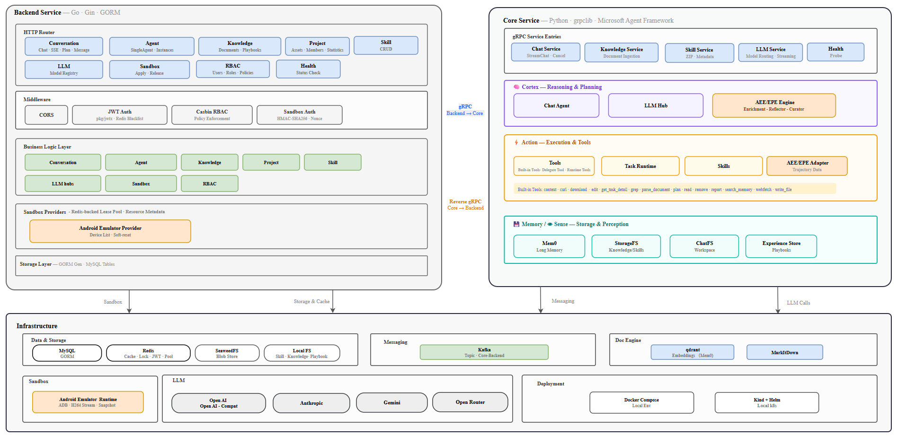
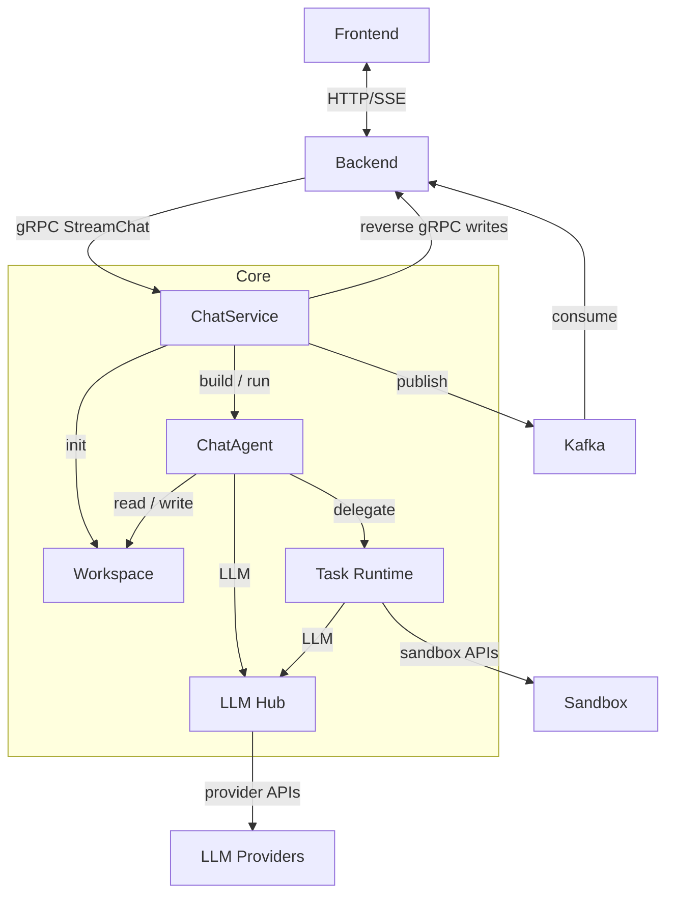
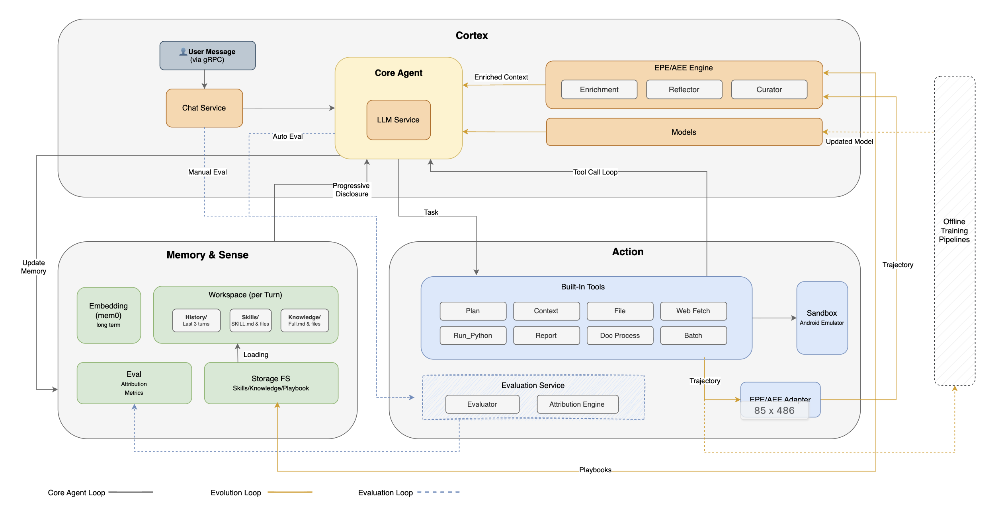
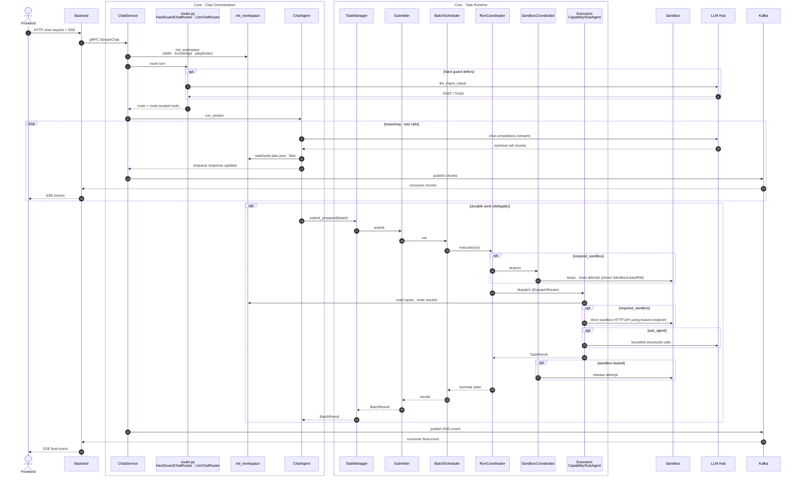

# Sico Technical Report

## 1. Vision: Symbiotic Intelligence for Co-Evolution

### 1.1 From Tools to Workforce

Most AI assistants today remain at the "tool" stage: they can generate content, but they often cannot reliably drive tasks to validated outcomes, operate within accountable workflows, or improve through a sustained feedback loop. Sico reframes AI agents as Digital Workers: long-lived, structured capability units that can be managed, evaluated, and continuously improved through real work.

- **Digital Workers** execute repeatable tasks with increasing reliability and consistency.
- **Humans (Operators)** set goals, evaluate outcomes, and provide corrections.
- System distills these corrections and task-level signals into **two complementary forms of improvement**: reusable execution experience (strategies, playbooks, memories) that takes effect on the next run, and structured training data that feeds back into the base model so the worker's intrinsic capability grows over longer cycles.

### 1.2 The Co-Evolution Loop

A Digital Worker's capabilities improve along **two complementary tracks**, both driven by real-world execution and Operator guidance:

- **Training-free evolution**: This track accumulates reusable strategies, playbooks, and memories *around* the model. These improvements can take effect within the current session or in subsequent executions.
- **Training-based evolution**: This track converts execution outcomes, Operator corrections, and task trajectories into high-quality training data for SFT/RL pipelines, enabling the base model to improve over longer cycles.

```text
  Operator                                    Digital Worker
     │                                             │
     │── set goal ──────────────────────────────>  │
     │                                             │── execute (traced)
     │                                             │── produce outcomes
     │ <── request intervention (when uncertain) ─ │
     │── provide corrections ──────────────────>   │
     │                                             │
     │         ┌──────────────────────────────┐    │
     │         │      Experience Store        │    │
     │         │  trajectories, corrections,  │<───│
     │         │  outcomes, strategies        │    │
     │         └──────────────┬───────────────┘    │
     │                        │                    │
     │           training-free feedback            │
     │                        │  retrieve & apply  │
     │                        ├───────────────────>│  (enriched context,
     │                        │                    │   updated strategies)
     │           training-based feedback           │
     │                        │  SFT / RL          │
     │                        └───────────────────>│  stronger base model
     │                                             │
     │  <── improved capability ───────────────────│
```

Each task execution generates signals about effective strategies, failed steps, and environment responses. Sico routes these signals into **two feedback loops**: a training-free loop that distills them into reusable experience the Digital Worker can retrieve and apply in future executions ([§5.1](#51-action--memorysense-evolution-training-free)), and a training-based loop that converts them into high-quality training data for improving the base model through SFT/RL ([§5.2](#52-cortex-evolution-training-based)). Together, these loops reduce repeated errors in the short term while raising baseline competence over the long term.

As execution quality improves, the need for repetitive Operator intervention is expected to decrease. Prior human corrections are incorporated into both the worker's strategy selection process and the model improvement pipeline. Over time, Operator judgment continuously shapes worker behavior, while Digital Workers become increasingly capable of handling routine execution with less supervision.


---

## 2. System Architecture

### 2.1 Service Topology
Sico separates user-facing serving, Core orchestration, and delegated execution into clear ownership boundaries. The **Backend** owns HTTP/SSE ingress, authentication, and primary persistence. **Core** owns turn orchestration, workspace state, LLM/tool coordination, and Task Runtime execution. Sandboxes are leased per run only when isolated execution is needed. The static topology diagram shows deployed service boundaries; the runtime topology below simplifies the chat execution path.



At runtime, the frontend sends the chat request and receives the SSE stream over HTTP. Deployments may proxy this traffic before Backend, but the simplified diagram treats it as a Frontend-Backend link. Backend invokes Core's `StreamChat` gRPC endpoint to start the turn, while user-visible streaming is decoupled through Kafka and SSE. Core writes platform-owned state through reverse gRPC; [§4.9](#49-communication-mechanisms) expands the exact services. Inside Core, `ChatService` initializes the workspace, routes the request, and runs `ChatAgent`; delegated work enters Task Runtime and may call the LLM Hub or leased sandbox APIs. The detailed per-turn sequence is expanded in [§4.1](#41-end-to-end-flow).


```mermaid
flowchart TB
Frontend["Frontend"] <-->|"HTTP/SSE"| Backend["Backend"]

subgraph Core["Core"]
   direction TB
   ChatService["ChatService"] -->|"init"| Workspace["Workspace"]
   ChatService -->|"build / run"| ChatAgent["ChatAgent"]
   ChatAgent -->|"read / write"| Workspace
   ChatAgent -->|"delegate"| TaskRuntime["Task Runtime"]
   ChatAgent -->|"LLM"| LLMHub["LLM Hub"]
   TaskRuntime -->|"LLM"| LLMHub
end

Backend -->|"gRPC StreamChat"| ChatService
ChatService -->|"reverse gRPC writes"| Backend
ChatService -->|"publish"| Kafka["Kafka"]
Kafka -->|"consume"| Backend
TaskRuntime -->|"sandbox APIs"| Sandbox["Sandbox"]
LLMHub -->|"provider APIs"| LLMProviders["LLM Providers"]
```

The `Workspace` provides shared execution state for a turn. Initialization materializes skills, knowledge, playbooks, and attachments before routing ([§4.2](#42-workspace-initialization)); `ChatAgent` writes plans and intermediate artifacts during reasoning; delegated batches publish outputs under `results/` for later steps to consume. This keeps cross-component coordination file-based and auditable, while platform persistence remains centralized behind Backend reverse gRPC services.

### 2.2 Protobuf-Driven Development

All cross-service contracts are defined in `proto/` and generated to four targets:

| Target | Generator | Output |
|--------|-----------|--------|
| Go gRPC stubs | `protoc` | `backend/internal/transport/grpc/pb/` |
| Go HTTP DTOs | `protoc` + `protoc-go-inject-tag` | `backend/internal/transport/http/dto/` |
| Go reverse gRPC | `protoc` | `backend/internal/transport/reverse_grpc/pb/` |
| Python stubs | `betterproto2` | `core/app/pb/` |

The files under `proto/` are the source of truth for cross-service contracts. Generated Go and Python outputs must be regenerated whenever these contracts change.

### 2.3 Authentication and Middleware

Backend serves two kinds of callers: human Operators using the web client and machine clients running inside Sandboxes. The two audiences use different middleware stacks:

| Audience | Mechanism | Replay protection |
|----------|-----------|-------------------|
| Users (web client -> operator-facing management API) | JWT (HS512) + Casbin RBAC | JWT token store (Redis when `REDIS_HOST` is set, else in-process cache), invalidated on logout via `JWTAuth.DestroyToken` |
| Sandbox clients (machine → API) | HMAC-SHA256 with `X-Sico-*` headers, per-client secret from `SANDBOX_CLIENT_SECRET_<CLIENT_ID>` | Redis nonce store |

The JWT middleware applies to user-facing APIs, with explicit exemptions for login, user registration (`POST /rbac/user`), health, public LLM runtime generation, project asset upload/completion/deletion and SAS retrieval, API documentation, and selected sandbox route prefixes (`apply`, `release`, `resources/`, and `device/`). The sandbox client endpoints `/api/sico/sandbox/apply` and `/release` then pass through a dedicated HMAC-SHA256 middleware instead of JWT; secrets are compared with `hmac.Equal`.

### 2.4 Infrastructure Dependencies

All stateful systems below are provisioned automatically by `make compose-up` or `make kind-up`:

| Dependency | Role |
|------------|------|
| **MySQL** | Primary store (GORM), schema managed by `golang-migrate`, auto-applied at startup. |
| **Redis** | Cache, distributed locks, JWT blacklist, sandbox lease pool, sandbox nonce store. |
| **Qdrant** | Vector store for Mem0-backed long-term memory. |
| **Kafka** | Event bus for Core → Backend streaming chunks (decouples gRPC from SSE). |
| **SeaweedFS** | Blob storage for uploads, artifacts, and workspace assets. |
| **Nginx** | Single reverse-proxy entry point in front of Frontend and Backend. |
| **LLM providers** | OpenAI, Azure, Anthropic, Gemini, OpenRouter, etc., accessed via the LLM Hub ([§3.1](#31-cortex-reasoning-and-planning)). |

Core never connects to MySQL directly. Primary relational persistence is mediated by Backend through reverse gRPC, while Core keeps execution artifacts and memory-related state in workspace files, local stores, and Mem0/Qdrant-backed memory. This keeps the primary data model centralized in Backend without requiring Core to own schema migrations.

### 2.5 Product Surface and Platform Domains

The Frontend is built from source in this repository as a **pnpm workspace + Turborepo monorepo**. The main application lives in `frontend/packages/app`; shared UI, configuration, and cross-application packages live alongside it under `frontend/packages/`. Production images run the same source build from `frontend/deployments/docker/Dockerfile` and serve the resulting static application through Nginx.

Beyond the chat, knowledge, skill, and sandbox paths described in detail below, Backend exposes HTTP surfaces for organizations, notifications, scheduled tasks, authentication state, and case replay. Notifications, authentication state, and case replay also expose reverse gRPC callbacks used by Core; organization and scheduled-task management do not currently register reverse gRPC services. Together these surfaces provide the management, governance, and integration boundary around the Core execution loop.

### 2.6 Observability

Both serving layers are instrumented with **OpenTelemetry**. Backend applies `otelgin` middleware to the HTTP router and initializes telemetry around server startup; Core instruments its `grpclib` services and shared gRPC clients through `app/utils/otel.py`. Task Runtime also publishes in-process audit and metrics events before recovery and gRPC serving begin. This provides request-level traces at service boundaries and runtime-level signals for delegated execution.

---

## 3. Cortex-Action-Memory

A Digital Worker is not a single prompt or a model wrapper. It is a structured capability unit with three layers:

```
┌───────────────────────────────────────────────────────────┐
│                      Digital Worker                       │
├──────────────┬──────────────────┬─────────────────────────┤
│    Cortex    │      Action      │    Memory & Sense       │
│  Reasoning   │   Skills, tools, │  Project knowledge,     │
│  & planning  │   sandbox envs   │  execution experience   │
└──────────────┴──────────────────┴─────────────────────────┘
```

### 3.1 Cortex: Reasoning and Planning

All LLM traffic flows through the **LLM Hub** (`core/app/llmhubs/`), a unified runtime with adapters for multiple providers:

- **Model resolution**: built-in models are loaded from Core YAML configs; for DB-sourced custom models, Backend resolves the model per request and passes a `RuntimeModelDefinition` (including decrypted secrets) alongside the gRPC call, so the current main path does not require Backend DB models to be globally registered in Core
- **Adapter pattern**: selects the right adapter based on `provider_template_type` from six implementations. Four target specific vendor protocols (Azure OpenAI, OpenAI-compatible, Anthropic, Gemini); two are generic, config-driven adapters (HTTP-JSON, HTTP-binary) that let an operator wire an arbitrary HTTP model endpoint into the hub purely through field mapping and JSONPath extraction, with HTTP-binary streaming returned artifacts (images, audio) to blob storage.
- **Streaming agent adapter**: translates framework-neutral agent state into LLMHub requests and maps streamed text, tool calls, and usage back into typed loop events

The main and delegated agents use the same framework-neutral loop infrastructure. `ChatAgent` hosts a `NativeAgentLoopEngine`, while `HubStreamingAgentLLM` handles LLMHub streaming and `ChatCapabilityToolController` executes route-scoped capabilities. Every model turn, capability request/result, completion, and usage update is represented as a typed event and written to a JSONL transcript.

**Planning** is implemented through autonomous LLM tool calls, not hard-coded workflows. The LLM uses three plan tools (`plan_read`, `plan_write`, `plan_tool_call_message_update`) to create and manage execution plans in real time. Plans support cancellation (via marker files checked at most once every 2 seconds while LLM stream updates are arriving) and status tracking (`pending`, `in_progress`, `completed`, `failed`, `require_human_input`).

### 3.2 Action: Skills, Tools, and Sandbox

#### Built-in Tools

Core defines a set of 16 built-in function tools plus one server-side `web_search` spec. Rather than handing the whole set to every turn, the chat agent receives a **route-scoped** subset (`fast` / `task`); role-level differentiation comes from skills, knowledge, playbooks, and runtime context (workspace, plan, sandbox session) on top of that shared definition (the route is decided by the router chain in [§4.3](#43-route-classification-intent-check), and the surface each route receives is defined in `core/app/biz/chat/tool_registry.py`; see [§4.6](#46-tool-execution)):

| Category | Tools |
|----------|-------|
| **Workspace context** | `context` |
| **File I/O** | `read`, `write_file`, `edit`, `grep`, `remove` |
| **HTTP & web** | `webfetch`, `curl`, `download` |
| **Document parsing** | `parse_document` |
| **Planning** | `plan_read`, `plan_write`, `plan_tool_call_message_update` |
| **Memory** | `search_memory` |
| **Reporting** | `report` |
| **Task inspection** | `get_task_detail` |

Durable "real work" (running commands, driving sandboxes, executing skills) is intentionally **not** a built-in tool. It is funneled through a single `delegate` tool added to the `task` route, which hands the work to the Delegated Task Runtime ([§4.7](#47-delegated-task-runtime)). `curl` is dual-purpose: the agent uses it for arbitrary HTTP fetches, while sandbox HTTP APIs are driven by the task runtime, not by the chat agent directly.

#### Skills

A **Skill** is a packaged capability defined by a `SKILL.md` file (YAML frontmatter + Markdown) plus optional runtime scripts and config. Skills can be scoped to a project (shared by all agents) or to a specific agent.

Sico compiles skills **ahead of time** rather than re-interpreting `SKILL.md` at runtime. When a skill is uploaded or updated, the backend calls Core to run the **Skill Resolver** ([§3.2 → Skill Resolver](#skill-resolver-build-time-compilation)), an LLM pass that compiles the human-written skill into two artifacts:

- `resolved/cortex/` : the agent-facing reference files (the `SKILL.md` and any docs/schemas it points to), copied into the workspace for the LLM to read.
- `resolved/actions.json` : a deterministic, executable action manifest (argv steps with typed parameters and placeholders) that the task runtime executes with **zero LLM calls** at run time.

At the start of each chat turn, workspace initialization copies the resolved cortex files for all relevant skills into the agent's working directory and generates an `index.json`. Capability cards rendered from that index are appended to the system prompt, and the LLM autonomously decides which skills to read and, when execution is needed, dispatches them through `delegate`.

#### Skill Resolver (build-time compilation)

The Skill Resolver (`core/app/biz/skill/resolver.py`) is what makes skills cheap and reproducible at run time: a skill author writes a normal `SKILL.md`, and the resolver compiles it **once, at upload time**, into the `actions.json` manifest described above. The design has four notable properties:

- **Zero-LLM runtime.** The expensive interpretation (what to run, in what order, with which parameters) happens once during the build-time LLM pass. At run time the task runtime only reads `actions.json` and executes argv steps, so skill execution is deterministic, fast, and auditable.
- **Structured, validated output.** The resolver emits a Pydantic-validated `ResolvedSkillOutput` (`cortex` + `actions`), where each action carries `infra_requirements` (e.g. `sandbox.android`, `sandbox.windows`), typed `parameters`, and `steps` (`argv` with built-in placeholders like `{workspace_dir}`, `{result_dir}` and sandbox placeholders such as `{sandbox.android}`). Invalid output is retried with the error fed back into the prompt, up to 3 attempts (`_MAX_RESOLVER_ATTEMPTS`); on persistent failure it falls back to a cortex-only skill with no actions.
- **Incremental re-resolution.** On re-upload the resolver diffs the previous and current skill files (budgeted to `_MAX_TOTAL_DIFF_BYTES`) and passes the diff plus the previous `actions.json` into the prompt, so unchanged skills reuse prior output and changed skills are adapted incrementally instead of recompiled from scratch.
- **Versioned persistence.** The backend `skill` domain stores each resolution as a new `SkillVersionModel` row, so skill definitions are versioned and a current version is always resolvable.

At run time, `SkillLoader` (`core/app/biz/task_runtime/capabilities/loader.py`) projects each resolved action into a **CapabilityCard** (name, parameters, infra requirements, visibility). Preparation projects caller-visible cards into capability descriptors: the shared task planner chooses among them for unresolved instruction items, tabular preparation binds rows to them, and the sub-agent loop in [§4.7](#47-delegated-task-runtime) invokes only its explicit grants.

#### Sandbox Environments

Sandbox capabilities are exposed as HTTP APIs on each sandbox instance. The chat agent never acquires or drives a sandbox directly. When a delegated task declares a `required_sandbox`, `SandboxCoordinator` manages the run's lease and reset/release lifecycle; the selected capability or skill action uses the leased endpoint for operations such as tap or install. The sandbox runtime therefore only needs to ship its HTTP server, not per-endpoint chat-agent wrappers. See [§4.7](#47-delegated-task-runtime) and [§4.8](#48-sandbox-observable-execution-environments) for details.

### 3.3 Memory & Sense: Experience & Contextual Awareness

A Digital Worker needs different kinds of memory at very different time scales. Rather than putting everything into a single vector store, Sico splits memory into five layers, each backed by the storage that best fits its access pattern.

| Memory Type | Mechanism | Scope | Storage |
|-------------|-----------|-------|---------|
| **Short-term (in-turn)** | LLM context window + plan scratchpad | Current task | LLM context + local FS (`plan.json`) |
| **Recent history** | Prior `conversation.json` turns selected newest-first up to the prompt-history token budget, then prepended in chronological order | Per `(agent_instance, user, conversation)` | Local FS (`CHAT_FS`) |
| **Long-term** | Mem0 facts extracted per turn, retrieved on demand by `search_memory` | Per `(user, agent_instance, conversation)`; `conversation_id` is stored as Mem0 `run_id` | Qdrant vector store |
| **Project knowledge** | Knowledge bases and workspace files parsed with MarkItDown, then materialized into the agent workspace | Shared within a project or scoped to an agent | Local FS / object storage |
| **Execution experience** | Playbooks produced by the Reflector → Curator pipeline ([§5.1](#51-action--memorysense-evolution-training-free)) | Content and runtime retrieval per `agent_instance`; Backend catalogue metadata per `(project, agent_instance)` | Local FS content + Backend knowledge metadata |

#### Memory hierarchy

```
   time scale             layer                            who decides what to load
   ──────────────         ─────────────────────            ────────────────────────
   this LLM call    ───►  in-turn context window     ◄──   ChatAgent (always)
                          + plan.json scratchpad

   prior turns      ───►  token-bounded history      ◄──   ChatAgent (always)
                          conversation.json files in the current conversation

   prior turns in   ───►  Mem0 / Qdrant facts        ◄──   LLM (calls search_memory)
   this conversation      keyed by (user, agent, conversation/run)

   per-task setup   ───►  workspace skills/knowledge ◄──   workspace_init + LLM read
                          + playbook (§5.1)

```

#### Long-term memory: Mem0 + Qdrant

Long-term memory is the only memory layer backed by a vector database. It uses [Mem0](https://docs.mem0.ai/) as the orchestration layer, with **Qdrant** as the vector store. In the default deployment config, Azure OpenAI serves as both the embedder (`text-embedding-3-small`, 1536-dim) and the fact-extraction LLM, both are swappable via `mem0_config.yaml`. The flow is:

```
chat turn ends
  └─► _enqueue_memories(user_message, assistant_message)
        └─► AsyncJobRunner (background worker pool, non-blocking)
              └─► Mem0.add(messages, user_id, agent_id, run_id=conversation_id)
                    ├─ extraction LLM: distill atomic facts
                    ├─ embedder: encode each fact
                    ├─ Qdrant: upsert (vector, payload{user_id, agent_id, run_id, ...})
                    └─ internal LLM: decide ADD vs UPDATE vs NOOP
```

Two design choices matter:

- **The expensive write work runs asynchronously after enqueue.** Memory writes go through `AsyncJobRunner` (a 16-worker `asyncio` pool backed by a bounded 200-item queue). `ChatAgent` awaits insertion into that queue, so a full queue can apply backpressure at the end of an attempt; once accepted, the Mem0 / Qdrant / extraction-LLM work runs in a background worker. Enqueue and worker failures are logged and do not fail the chat turn, although that turn's memory update may be absent.
- **Read is on-demand, not auto-injected.** Memory is **not** stuffed into the system prompt every turn. Instead, the LLM autonomously decides when to call the built-in `search_memory` tool. The tool runs a similarity search in Qdrant filtered by `(user_id, agent_id, run_id=conversation_id)` (default `threshold=0.5`, `top_k=5`) and returns the matching facts to the LLM. Each call is recorded as a `tool_call` on the plan, so Operators can see *what* the agent recalled and *when*.

This RAG-style "pull" model trades a little recall reliability (the LLM may forget to query) for a large gain in context cleanliness: long sessions do not get polluted by unrelated old memories.

#### Memory vs. Playbook

These two are easy to confuse but have **disjoint responsibilities**:

| | Long-term memory (Mem0) | Playbook (Experience Learning) |
|---|---|---|
| Stores | User/conversation **facts** ("user is in Shanghai timezone") | Execution **strategies** ("for task X, prefer approach Y") |
| Produced by | Mem0 extraction on every turn | Reflector → Curator after task completion |
| Isolation | `(user, agent_instance, conversation)` (`conversation_id` maps to Mem0 `run_id`) | Content/retrieval: `agent_instance`; Backend metadata: `(project, agent_instance)` |
| Injection | LLM calls `search_memory` on demand | Chat snapshots Markdown under `playbooks/`; delegated-task retrieval appends ranked bullets to `TaskSpec.instructions` (and `args["instructions"]` when applicable) |
| Quality signal | None | `helpful` / `harmful` citation counts |

Memory remembers **who the user is and what was said**; the Playbook remembers **how to do this kind of work**.

#### Document parsing: feeding heterogeneous sources into the workspace

Both the **project knowledge** layer and the `parse_document` built-in tool ([§4.6](#46-tool-execution)) share one ingestion path: a `DocExtractor` (`core/app/document/`). The abstract interface (`base.py`) exposes `extract(file_path)` and `extract_from_url(url)`, each returning a `(full_text, summary)` pair; the default `extract_from_url` downloads a SAS/HTTP source to a temp file and delegates to `extract`. The shipped implementation (`MarkitdownDocExtractor`, `markitdown.py`) uses the open-source **MarkItDown** library to convert heterogeneous formats (PDF, Word, Excel, etc.) into Markdown, then runs a single capped LLM call (input truncated to 50K chars, summary ≤1024 tokens) to produce the summary, degrading to an empty summary if that call fails. This is what turns uploaded knowledge bases and ad-hoc attachments into the plain-text workspace files the agent can `read`.

### 3.4 Three Loops at the Heart of Sico

Cortex, Action, and Memory are the static anatomy of a Digital Worker. What makes the worker *alive* is the way these three layers are wired into **three running loops** - and these loops are the actual core of Sico.




| Loop | Section | What it does | What it consumes / produces |
|------|---------|--------------|------------------------------|
| **Execution Loop** | [§4](#4-core-execution-loop) | Turn an Operator goal into traced agent execution | Goal -> trajectory + outcome |
| **Evolution Loop** | [§5](#5-evolution-loop) | Train the Cortex and distill trajectories into reusable strategies | Outcomes -> training signals / Playbook -> stronger next run |
| **Evaluation Loop** | [§6](#6-evaluation-loop) | Attribute *why* a task failed *(planned, not yet shipped)* | Failed trajectory -> L1–L4 verdict -> input back into Evolution |

#### Mapping to *Symbiotic Intelligence for Co-Evolution*

The three loops are exactly the operational form of the vision in [§1](#1-vision-symbiotic-intelligence-for-co-evolution):

- **Execution Loop** represents the runtime layer where Digital Workers perform tasks. The Operator specifies the goal, and the Cortex-Action-Memory stack executes with workspace tools, delegated task-runtime runs, and, when a run declares `required_sandbox`, an observable Sandbox. This loop generates structured execution traces, including actions, intermediate states, tool outputs, and environmental feedback.
- **Evolution Loop** converts execution traces into reusable capability. Successful strategies and recurring failure patterns are extracted from prior runs and incorporated into the worker's future prompt context. In this way, capability accumulation happens at the platform layer, rather than relying only on model-weight updates.
- **Evaluation Loop** provides the governance and improvement mechanism. Failure attribution classifies errors into categories such as Task Instruction Issue, Digital Worker (DW) Capability Issue, and Environment Issue. These structured signals help the Operator determine the appropriate correction and provide targeted input for the Evolution Loops.

Together, the three loops form a continuous improvement cycle: Execution produces experience, Evolution converts experience into reusable capability, and Evaluation identifies where the worker or the environment should be improved. When applied repeatedly to the same Digital Worker, this cycle enables co-evolution between the Operator and the Digital Worker.

---

## 4. Core Execution Loop

Chat is where Operator intent meets Digital Worker execution. It coordinates four communication mechanisms (gRPC, reverse gRPC, Kafka, SSE) and orchestrates workspace setup, agent reasoning, tool execution, planning, and cleanup in a single streaming pass.

### 4.1 End-to-End Flow


```mermaid
sequenceDiagram
   autonumber
   actor FE as Frontend
   participant BE as Backend
   box Core · Chat Orchestration
      participant CS as ChatService
      participant RT as router.py<br/>HardGuardChatRouter · LlmChatRouter
      participant WS as init_workspace
      participant CA as ChatAgent
   end
   box Core · Task Runtime
      participant TM as TaskManager
      participant SUB as Submitter
      participant SCH as BatchScheduler
      participant RC as RunCoordinator
      participant SC as SandboxCoordinator
      participant EX as Executors<br/>Capability/SubAgent
   end
   participant SBX as Sandbox
   participant LLM as LLM Hub
   participant KAFKA as Kafka

   FE->>BE: HTTP chat request + SSE
   BE->>CS: gRPC StreamChat

   CS->>WS: init_workspace<br/>(skills · knowledge · playbooks)
   CS->>RT: route turn
   opt hard guard defers
      RT->>LLM: llm_intent_check
      LLM-->>RT: FAST / TASK
   end
   RT-->>CS: route + route-scoped tools
   CS->>CA: run_stream

   loop reasoning · tool calls
      CA->>LLM: chat completions (stream)
      LLM-->>CA: text/tool-call chunks
      CA->>WS: read/write plan.json · files
      CA-->>CS: enqueue response updates
      CS->>KAFKA: publish chunks
      KAFKA-->>BE: consume chunks
      BE-->>FE: SSE events
   end

   opt durable work (delegate)
      CA->>TM: submit_prepared(batch)
      TM->>SUB: submit
      SUB->>SCH: run
      SCH->>RC: execute(run)
      opt required_sandbox
         RC->>SC: acquire
         SC->>SBX: lease · reset attempt (stores SandboxLeaseRef)
      end
      RC->>EX: dispatch (DispatchRouter)
      EX->>WS: read inputs · write results/
      opt required_sandbox
         EX->>SBX: drive sandbox HTTP API using leased endpoint
      end
      opt sub_agent
         EX->>LLM: bounded structured calls
      end
      EX-->>RC: TaskResult
      opt sandbox leased
         SC->>SBX: release attempt
      end
      RC-->>SCH: terminal state
      SCH-->>SUB: results
      SUB-->>TM: BatchResult
      TM-->>CA: BatchResult
   end

   CS->>KAFKA: publish END event
   KAFKA-->>BE: consume final event
   BE-->>FE: SSE final event
```

1. Frontend sends the chat request to Backend over HTTP and keeps an SSE stream open for user-visible updates.
2. Backend forwards the turn to Core through `StreamChat`; the response stream itself remains decoupled through Kafka and SSE.
3. `ChatService` initializes the workspace before routing, materializing skills, knowledge, Playbook snapshots, and attachments so every route starts with the same execution context.
4. `ChatService` asks the router chain to classify the turn. `HardGuardChatRouter` handles obvious cases; when it defers, `LlmChatRouter` calls the LLM Hub. The decision is `FAST` or `TASK`, and the `ToolRegistry` turns it into the route-scoped tool set.
5. `ChatService` starts `ChatAgent.run_stream()`. During the main reasoning loop, `ChatAgent` streams through the LLM Hub and invokes tools that read and write workspace files such as `plan.json`. It places response updates on an internal queue; `ChatService` drains that queue, persists and caches the responses, and publishes them to Kafka for Backend to deliver as SSE events.
6. If the agent calls `delegate`, durable work enters Task Runtime. `TaskManager`, `Submitter`, `BatchScheduler`, and `RunCoordinator` claim and execute each run; `SandboxCoordinator` leases a sandbox when required and attempts cleanup on terminal paths; executors read inputs and write outputs under `results/`.
7. When a delegated skill run reaches a terminal state, its capability executor invokes the Experience Learning trigger with the in-memory run and result. Eligible trajectories are parsed and dispatched to the Reflector-Curator pipeline in the background according to `EPE_TRIGGER_MODE` (`per_run`, `per_batch`, or `disabled`).
8. When the chat turn reaches a terminal state, Core publishes the final event through Kafka for SSE delivery, persists platform-owned state through reverse gRPC, then performs non-blocking cleanup and background work such as plan cleanup and Mem0 memory write.

### 4.2 Workspace Initialization

`init_workspace()` runs at the **start of every turn** (before routing and before the agent
reasons) and refreshes a workspace keyed by `(agent_instance_id, user_id, conversation_id)`, not by turn. Each
turn it clears and re-materializes reusable context (skills, knowledge, playbooks), clears the
workspace `history/` scratch directory, and retains attachments plus prior delegated outputs
across turns:

```text
agent_instance/{agent_instance_id}/user/{user_id}/conversation/{conversation_id}/
├── turn/
│   └── {turn_id}/
│       ├── plan.json                # Plan state (created during execution)
│       ├── conversation.json        # Full turn transcript (written after execution)
│       └── rerun_sources/           # Compact replayable batch inputs written at materialization
├── .source-repository/
│   └── workspace/                   # Private; never mounted as the general workspace
│       ├── index.json               # Active source_ref -> immutable projection
│       ├── objects/{hash}/          # Immutable raw inputs
│       └── snapshots/{projection}/
│           ├── manifest.json
│           └── tables/*.jsonl
├── workspace/                       # Conversation-scoped; refreshed each turn
│   ├── attachments/                 # Retained across turns
│   │   ├── {file_name}              # Downloaded from SAS URLs
│   │   ├── {file_name}_url.txt      # Original URL reference
│   │   └── index.json               # [{name, path, source_turn_id}, ...]
│   ├── knowledge/                   # Cleared + re-copied each turn
│   │   ├── {doc_id}/ or {link_id}/
│   │   └── index.json
│   ├── playbooks/                   # Cleared + re-copied each turn when enabled
│   │   └── {section_name}.md
│   ├── skills/                      # Cleared + re-copied each turn
│   │   ├── {skill_id}/SKILL.md
│   │   └── index.json
│   ├── results/                     # Retained outputs of the `delegate` task tool
│   │   └── {batch_id}/
│   │       └── artifacts/
│   ├── history/                     # Hidden bounded projection; rerun metadata only
│   │   └── turn-{turn_id}/
│   │       └── rerun_sources/*.json
│   └── case_sources/                # Read-only legacy V1 workbook snapshots
```

**Skills injection**: The skills section, capability cards rendered from each skill's resolved
actions and backed by `skills/index.json`, is appended to the system prompt so the LLM sees what
capabilities are available. The LLM autonomously decides which skills to read (via the `read`
tool) and follow.

**Playbook injection**: If Experience Learning is enabled, previously learned strategies are
rendered as `.md` files in the workspace for audit and optional tool-based reading. The ChatAgent is
not explicitly pointed at those files; execution-relevant bullets are retrieved separately when a
delegated task is materialized ([§5.1.3](#513-dual-feedback-paths)).

**Recent conversation history**: Prior turns are *not* read from `workspace/history/` by the
agent. Prompt history is selected newest-first from the current conversation's persisted turn store
at prompt-build time (`_load_recent_history` → `CHAT_FS.read_conversation`) up to the prompt-history
token budget, then prepended in chronological order. Workspace init
uses the hidden `history/` directory only for at most three recent turns that contain compact
`rerun_sources` artifacts; it never restores complete plans, transcripts, or reports there.
Each compact rerun source is bounded before persistence and projection. For a task that originally consumed an immutable
tabular object, the artifact stores only its logical `source_ref`, original content hash, and a reserved materialization
hint. Preparation accepts that hint only for an exact prebound capability, verifies that the active manifest still has
the same hash, and rematerializes the object URI. This permits snapshot-only reruns without exposing private paths and
rejects a logical source that has since changed content.

### 4.3 Route Classification (Intent Check)

After the workspace is assembled but before the `ChatAgent` is built, Core decides which of two routes the turn takes: `fast` (no tools) or `task` (the full tool set plus `delegate`; see [§4.6](#46-tool-execution)). Misrouting either starves a real task of `delegate` or hands a greeting an oversized toolset. Routing lives in `core/app/biz/chat/router.py` as a **chain** of `ChatRouter` stages: each decides or returns `None` to defer, and an exhausted chain falls back to `TASK`.

**Stage 1: hard guard (cheap heuristic).** `HardGuardChatRouter` is a pure keyword + attachment check that costs no LLM call. Its keyword lists live in `core/app/biz/chat/route_rules.toml`:

| Signal | Route |
|--------|-------|
| Empty prompt with no attachments | `FAST` (nothing to act on) |
| Task keywords (`execute`, `run all`, `重跑`, …) | `TASK` |
| Bare greeting / thanks (`hello`, `hi`, `hey`, `thanks`), whole message, no attachments | `FAST` |
| Anything else (including an empty prompt with attachments) | defer to stage 2 |

The two lists match differently. Task keywords are substrings, since a wrong `TASK` only skips the classifier call. Greetings must match the whole message, since a wrong `FAST` answers a real request with no tools: `"hello, run tests"` is a request, not a greeting.

A hard-guard hit skips the LLM intent check and the payload built only for it — `build_intent_input` defers the attachment conversion, the prior-conversation section, and the classifier-only context sections. Only the skills section is always rendered, since the system prompt needs it on both routes, and `init_workspace` runs before routing either way, so every route starts from the same workspace.

**Stage 2: LLM intent check.** `LlmChatRouter` runs a single-round LLM classifier with **structured output** (`ChatIntentCheckerOutput { route, reason }`). Its context reflects what the turn can actually do: the user prompt and attachments, compact source manifests, the unified delegate tool and direct tools, the workspace skills section, prior conversation, and prior execution/source snapshots.

**No read-only route.** An earlier `inspect` route sat between the two, differing from `task` by five tools. It was removed rather than tuned: "read-only" is not a stable user intent — answering "what did the last run do" can need `parse_document` or `curl` — so `task` handles those questions under a prompt that tells it not to write anything unasked.

**Defensive default.** Routing never blocks a turn. Any failure in the LLM path (non-zero invocation, empty response, JSON parse error, schema-validation failure) becomes `route = TASK`, and above it `ChatRouterChain` treats a router that *raises* as a deferral. When unsure, the fuller `task` toolset is the cheaper mistake. The chosen route is logged as `chat_route_decided` with the rule or classifier that picked it.

### 4.4 Agent Execution Loop

The main and delegated agents share the same framework-neutral execution loop. Three key abstractions divide responsibility:

| Component | Role |
|-----------|------|
| **ChatAgent** | Main-chat host that loads compact history, binds route-scoped capabilities, streams user-visible output, and persists conversation and event transcripts. |
| **NativeAgentLoopEngine** | Framework-neutral state machine shared with sub-agents; emits typed model, capability, completion, and usage events. |
| **HubStreamingAgentLLM** | LLMHub adapter that serializes loop state and maps streamed provider output into typed model actions. |

`ChatAgent.run_stream()` drives the main loop:

```
request = system_prompt + compact_history + user_message + route_capabilities

async for event in NativeAgentLoopEngine.run(request):
   ├── Record every typed event in events.jsonl
   ├── Stream model text deltas to the response queue
   ├── Execute one capability call and feed its observation into the next model turn
   ├── Persist conversation state at capability boundaries and completion
   └── Stop when completion is accepted, cancellation is detected, or the turn limit is reached
```

The loop admits at most one capability call per model turn. Capability observations are retained in loop state, while user-visible text continues through the existing response queue, reverse gRPC, Redis replay cache, Kafka, and SSE path.

### 4.5 Planning

Planning is implemented through **autonomous LLM tool calls**, not hard-coded workflows. The LLM decides when to create, read, and update plans during execution.

Three plan tools belong to the client-side `BUILTIN_TOOLS` collection and are also included in the route-scoped `CHAT_TOOLS` allow-list:

| Tool | Purpose |
|------|---------|
| `plan_read` | Read the current plan. The system prompt instructs the LLM to call this frequently - before starting work, after completing a step, and when uncertain about the next action. |
| `plan_write` | Create or update the plan. The input schema enforces at most one `in_progress` step, and persisted finished steps cannot be reverted to a running state. Sequential completion and stopping on `require_human_input` are prompt-level agent conventions rather than an automatic runtime pause. |
| `plan_tool_call_message_update` | Update the progress message of an existing tool call (when the original message is too long or outdated). |

**PlanEditor**: Each tool records its own progress via `ctx.plan_editor`:

```
PlanEditor # Writes plan.json, notifies ChatService -> PLAN event -> Kafka -> SSE
```

**Plan data model**:

```
Plan
├── title: str
├── steps: [PlanStep]
│   ├── title: str
│   ├── status: pending | in_progress | completed | failed | require_human_input | cancelled
│   └── tool_calls: [ToolCall]
│       ├── tool_name, message (recommended <20 words), tool_call_id
│       └── deliverables: [ToolDeliverable]  (e.g., acquired Sandbox ID)
└── extra: PlanExtra (user, agent, timestamp)
```

The LLM-facing `plan_write` schema only accepts the first five statuses (`pending`, `in_progress`, `completed`, `failed`, `require_human_input`). `cancelled` is reserved for the system: the LLM cannot emit it directly. It is produced by `Plan.to_cancelled()` whenever a cancellation marker file exists for the current turn (see below), so any subsequent `plan_read` reflects the cancelled state.

**Cancellation**: Frontend calls Backend's `CancelPlan` HTTP API -> Backend forwards via gRPC to Core -> Core writes a marker file (`CHAT_FS.plan.write_cancelled_marker`) -> the agent loop rate-limits `is_plan_cancelled` checks to at most once every 2 seconds (`CHECK_CANCELLED_PLAN_INTERVAL_SECONDS`) and breaks out of generation on detection. The check is performed inside the `async for` stream-update loop, not by an independent timer, so cancellation detection can be delayed while the upstream LLM produces no updates. From detection onward, `plan_read` returns the plan projected through `to_cancelled()`, surfacing the `cancelled` status to both the agent prompt and the frontend.

**Frontend interaction**: Each plan update flows through `PlanEditor.notify_plan_updated()` -> `ChatService` -> PLAN-type `ChatResponse` -> Kafka -> SSE -> Frontend renders progress. Frontend can also poll Backend's `GetPlan` HTTP API (which proxies to Core via gRPC) for the full plan state.

### 4.6 Tool Execution

Tools are organized into four categories. The built-in set is **route-scoped** by an explicit allow-list: `CHAT_TOOLS` (`core/app/biz/chat/tool_registry.py`) is the chat agent's tool surface, and `ToolRegistry` gives a route either all of it or none — `fast` gets nothing, `task` gets everything. The surface is heterogeneous: most entries are `FunctionTool`, while `web_search` is a plain Responses API spec with no `.name`, so duplicate detection resolves identity per shape. Route selection decides which tools a turn is offered, not what a delegated capability may do once called. Capability descriptors carry `effect`, `workspace_access`, and sandbox requirements; out-of-process handlers use `workspace_access` to choose a read-only or writable workspace mount, while sub-agent invocation policy can inspect the resolved descriptor before execution.

| Category | Tools | Registration |
|----------|-------|-------------|
| **Built-in** | `context`, `plan_read`, `plan_write`, `plan_tool_call_message_update`, `read`, `grep`, `write_file`, `edit`, `remove`, `report`, `webfetch`, `curl`, `parse_document`, `download`, `search_memory`, `get_task_detail` | `CHAT_TOOLS` allow-list, exposed per route by `ToolRegistry` |
| **Server-side** | `web_search` | A Responses API tool spec rather than a `FunctionTool`; declaring it routes the turn to the Responses API and the provider runs the search |
| **Task delegation** | `delegate(request_json)` with mixed `instructions` / `tabular` sources | Built from `DelegatePreparationService` when the route may delegate |
| **Sandbox actions** | Performed per task run inside the task runtime, not by agent-side tools | Owned by `SandboxCoordinator` (see [§4.7](#47-delegated-task-runtime)) |

Every tool receives a `ToolContext` via `function_invocation_kwargs`, providing access to the current user, agent instance, and plan editor.

**Sandbox leasing**: sandbox reserve / acquire / reset / release is owned by the task runtime's `SandboxCoordinator`, which leases one sandbox per task run that declares a `required_sandbox`, publishes the `ACQUIRED_SANDBOX` deliverable card, and attempts release on success, failure, cancellation, and stale-run recovery ([§4.7](#47-delegated-task-runtime)).

### 4.7 Delegated Task Runtime

The built-in tools in [§4.6](#46-tool-execution) let the chat agent read, edit, and report on its workspace, but they deliberately stop short of durable side-effecting work: running commands, executing skills, and driving sandboxes. That work is delegated to a separate **Task Runtime**, reached through a single `delegate` tool on the `task` route. This keeps the chat agent's tool surface small and observable while giving "real work" its own scheduled, retried, durably recorded, and crash-reconciled execution layer.

#### Delegation Flow

```
chat agent (task route)
   │  delegate(request_json: mixed sources)
   ▼
DelegatePreparationService                core/app/biz/chat/preparation/
   │  select canonical source snapshots → capability binding → WorkItem[]
   ▼
Shared TaskPlanner + assemble_batch()
   │  PreparedTaskBatch (one or more TaskSpec)
   ▼
TaskManager.submit_prepared()            core/app/biz/task_runtime/manager.py
   │  Submitter: plan sandboxes, create batch + per-run records
   ▼
Scheduler → RunCoordinator (per run)
   │  acquire sandbox if needed → executor claim (fencing token) → execute → write result → release attempt
   ▼
DispatchRouter → executor by kind:
   ├── capability (built-in payload or resolved skill action)
   └── sub_agent  (bounded LLM loop over an allow-listed capability set)
   │
   ▼  BatchResult (per-run statuses + summaries) returned synchronously to delegate
```

The chat coroutine **awaits** the `delegate` call: it suspends until every run in the batch reaches a terminal state, then receives the aggregated payload as the tool result. The task runs themselves execute as separate asyncio tasks, with progress streamed back onto the plan while the chat agent waits.

Core integrations import task-runtime lifecycle entrypoints from the `app.biz.task_runtime` package root. The `manager` module is the orchestration facade only; factory and recovery entrypoints remain owned by their respective modules and are re-exported exclusively through the package root.

#### Preparation Pipeline

`delegate` exposes one strict `request_json` contract containing a batch goal and one or more discriminated sources. Source inspection is a separate read-only domain: attachments and staged Knowledge are indexed before routing into content-addressed, typed snapshots shared by chat context, `parse_document`, and delegate preparation. The active-reference catalogue lives in a conversation-private repository outside the workspace and is not an authorization-free cache: Knowledge refs are atomically replaced from each turn's authorized staging set, while immutable objects/snapshots may outlive a detached ref for a 30-day grace period. Generic workspace tools and general workspace mounts cannot enumerate the repository; they consume bounded active-manifest projections instead. Preparation persists only a stable `sico-source://` reference. Runtime hash-verifies and mounts the selected object read-only only when an actual task argument contains that exact URI; provenance metadata alone grants no mount. The TASK agent asks for missing sheet scope before delegation whenever the manifest is ambiguous; delegate repeats scope validation as a consistency fallback but does not own file-format parsing.

An `instructions` source contributes explicit or unresolved work items; a `tabular` source selects rows from one or more canonical snapshots. Table-level capability/column binding and row validation complete before neutral `WorkItem`s cross into the shared planner. A pure `assemble_batch` helper is the only code that creates the final `PreparedTaskBatch`.

- **`instructions` source**: carries one or more goals, optional structured parameters, per-source capability/profile allow-lists, and optional prebinding. Up to 100 unresolved items and 500 KB of context are planned together in one structured LLM call; larger unresolved scopes require explicit dispatch bindings or narrowing.
- **`tabular` source**: selects typed rows from source snapshots, creates one capability binding plan per table, validates every selected row, then emits prebound work items. Exact case-ID filters run before the selected-row budget. Ambiguous execution platforms return clarification rather than forcing a capability choice. Capability schemas are deduplicated, and scopes above 50 ambiguous tables or 500 KB require explicit mappings. Parsing is bounded by file/source-row, column, decoded-cell, per-cell, and total display-character budgets. File parameters always bind to the immutable content-addressed raw object, so execution and retries cannot observe a later overwrite of the logical workspace path.

Preparation has four outcomes: success proceeds to runtime submission; `NeedsClarification` returns understood/missing/suggested context; `Rejected` reports a deterministic invalid-capability, scope, or permission outcome; and operational faults are mapped to `preparation_failed`. No non-success path allocates a task submission or creates runtime rows. One request is capped at 500 total work items, enforced before planning and submission. Capability providers and profiles are queried only when the request can use them, with caller identity attached. Join strategy and caller concurrency cap bypass the planner and flow directly into deterministic batch assembly.

For tabular execution, preparation also carries reporting instructions from the selected executable skill into the parent result. A single selected skill retains the legacy `skill_description` field; mixed-capability batches use a deduplicated, bounded `skill_descriptions` list.

Multi-task tool responses keep at most 10 detailed results. Their aggregate `report_urls` and `artifact_urls` lists are each capped at 50 entries. Aggregate counts, the artifacts root, omitted URL counts, and bounded omitted success/non-success run IDs preserve recovery through `get_task_detail` without returning every summary inline.

#### Sub-Agent Execution

The `sub_agent` dispatch is a **bounded, policy-constrained LLM loop** (`core/app/biz/task_runtime/sub_agent/executor.py`). Each step makes one structured-output LLM call that either calls a capability or returns a final answer; the loop is capped by `max_model_turns` (default `DEFAULT_MAX_MODEL_TURNS = 12`) and may only call capabilities allowed by both its dispatch grants and profile ceiling. Each invocation also passes through the profile's capability policy. Isolation is determined by the invoked capability's sandbox requirement and command backend, not by the sub-agent loop itself.

#### Execution Backends

The task runtime separates **what** is being executed from **where** command-like work runs:

| Axis | Choices | Meaning |
|------|---------|---------|
| **Dispatch kind** | `capability`, `sub_agent` | The semantic unit selected by preparation or a sub-agent planner. |
| **Command backend** | `local`, `docker`, `k8s` | The physical execution environment for command-like work. |

A `capability` is anything the runtime can invoke, whatever provided it — a built-in payload, a resolved skill action, later a GUI or MCP action. Each source is a `CapabilityProvider` behind one `CapabilityResolver`, and every capability runs through the same `CapabilityExecutor`, so adding a source never adds a dispatch kind.

This matters because `run_command` is **not** exposed as a chat built-in tool. It is a runtime capability selected only through delegated planning and executed by the built-in provider through the configured `CommandBackend`. The runtime's built-in capabilities currently are:

| Built-in capability | Behavior |
|--------------|----------|
| `builtin:run_command` | Executes an exact shell command from `args.command` through the configured command backend. |
| `builtin:file_convert` | Converts workspace-relative Excel `.xlsx` / `.xlsm` files to CSV artifacts. |
| `builtin:echo` | Emits a literal message, mainly for smoke tests and placeholder runs. |

Only `run_command` is lowered to a `CommandSpec` and sent through the `CommandBackend`; `echo` and `file_convert` run in process.

Skill execution uses the same backend axis: a resolved skill action is lowered to argv steps from `resolved/actions.json`, which the skill provider runs through the configured `CommandBackend`. A `sub_agent` does not get arbitrary shell access; it can only call capabilities on its allow-list, and each call runs as a real child run through that same single capability path.

`CommandBackend` selection is deployment-driven:

| Backend | How it runs | Isolation and storage notes |
|---------|-------------|-----------------------------|
| `local` | Runs commands as child processes on the Core host. | No process/container isolation; the workspace is the host directory. This is the zero-config default for direct local development. |
| `docker` | Runs each command in a throwaway `docker run --rm` container with bind mounts. | Docker is opt-in via `TASK_RUNTIME_BACKEND=docker`; it is never auto-selected just because Docker is installed. |
| `k8s` | Runs commands in a per-run Kubernetes sandbox pod (`ensure -> exec -> delete`). | Auto-selected when Core is running in-cluster unless `TASK_RUNTIME_BACKEND` overrides it. |

For container-style backends (`docker` / `k8s`), the shared workspace mount follows the capability descriptor's `workspace_access`: `read_only` and `none` are mounted read-only, while `read_write` is writable. The per-run `$SICO_RESULT_DIR` remains writable, and materialized source inputs are mounted read-only. Resolved skill execution collects files from its result directory and publishes them as artifacts; `file_convert` publishes its outputs explicitly, while `run_command` currently returns stdout/stderr without automatically collecting generated files. This command backend mechanism is distinct from Android emulator sandbox leasing: Android / GUI sandboxes are acquired only for runs that declare a `required_sandbox`, while command backends decide where shell commands and resolved skill steps execute.

#### Durability: State Machine, Fencing, and Recovery

Runs are not fire-and-forget coroutines; they are persisted records governed by an explicit state machine (`core/app/biz/task_runtime/domain/state_machine.py`):

- **States**: runs move `QUEUED → RUNNING →` a terminal state (`COMPLETED`, `FAILED`, `CANCELLED`, `TIMED_OUT`, `BLOCKED`); a batch can settle as `PARTIAL` when runs have mixed outcomes. Only retryable-terminal runs may reopen to `QUEUED`, guarded by compare-and-set.
- **Fencing tokens**: `claim_run` returns a token that `write_result` must present, so a stale worker cannot overwrite a run that was reclaimed after a crash or timeout.
- **Idempotency**: `submission_id` deterministically derives the batch ID, and each run has its own idempotency key. A replay observes the existing batch instead of claiming or executing duplicate work, provided its submission fingerprint still matches.
- **Recovery**: normal retry may reopen `FAILED`, `TIMED_OUT`, or `BLOCKED` runs to `QUEUED` under compare-and-set. Crash recovery does not resume execution: `StaleReconciler` settles orphaned `RUNNING` / `QUEUED` records as terminal failures or blocks, attempts sandbox cleanup, and finalizes batch and plan state.

#### Persistence and Sandbox Leasing

The task runtime owns no MySQL connection of its own. It persists batch/run state, claims, results, and progress through a dedicated **reverse gRPC** service, `ReverseTaskRuntimeService` ([§4.9](#49-communication-mechanisms)), backed by `DBRunStore` by default (with `FileRunStore` available for tests and explicit filesystem deployments). Sandbox leasing follows the same pattern: `SandboxCoordinator` reserves and acquires a sandbox per run, attempts a reset before execution, and retries release on terminal paths. Release state is persisted so failed cleanup remains visible to batch cleanup and stale-run recovery ([§4.8](#48-sandbox-observable-execution-environments)).

### 4.8 Sandbox: Observable Execution Environments

A Sandbox is an isolated, observable environment where Digital Workers execute real operations - mobile app testing, Windows automation, or general compute tasks.

#### Sandbox Types

Currently Sico ships the **Android emulator** sandbox (MuMu Player-based, ADB + HTTP API) for mobile app automation. The sandbox subsystem is designed to be extensible - additional runtime types can be added by implementing a provider adapter and exposing an HTTP control API; capabilities reach each acquired sandbox through the lease's `provider_base_url` or endpoint without new chat-agent tool code.

#### Lifecycle

```
  Assign (Web Client)          Reserve + Acquire            Reset
  ─────────────────          ──────────────────           ──────────
  Admin assigns sandbox       Task runtime leases one      Soft-reset the
  instances to an agent       sandbox per task run that    environment before
  instance via a Redis        declares required_sandbox    the run executes
  lease pool                  (SandboxCoordinator)

  Use                          Release
  ──────────                   ──────────────
  The run drives the sandbox   Lease returned to the pool
  HTTP API (tap, install, …)   after the run when release succeeds
```

**Automatic cleanup**: `SandboxCoordinator` attempts to release each acquired lease on terminal paths, with retries (`release`), cross-instance fallback (`release_stale`), and bulk cleanup (`release_many`). If all release attempts fail, the run remains marked `sandbox_released = false` so later batch cleanup or stale-run recovery can retry instead of silently treating the lease as clean.

#### Driving Sandboxes

Sandbox capabilities are exposed as HTTP endpoints on each sandbox instance, not as a per-endpoint set of agent-side `FunctionTool`s. The flow is owned end-to-end by the task runtime ([§4.7](#47-delegated-task-runtime)):

1. The chat agent submits `delegate(request_json)` and preparation emits a task whose selected capability descriptor declares `required_sandbox`.
2. `SandboxCoordinator` reserves and acquires one sandbox for that run, attempts a reset, and stores its endpoint and `provider_base_url` in `SandboxLeaseRef`. A reset failure is logged and execution continues with the acquired lease.
3. The selected capability drives the sandbox HTTP API (e.g. `POST /input/tap`, `POST /apps/install-url`) and the coordinator attempts to release the lease when the run completes.

This keeps the agent-facing tool surface small and uniform across sandbox types: adding a new sandbox runtime requires implementing its HTTP API, not generating a new family of tool wrappers. A typed, per-endpoint generator (OpenAPI → `FunctionTool`) is on the roadmap but not part of the current release.

#### Observability

Sandboxes provide operator-facing observability during execution:

- **VNC/H264 live streams**: Backend proxies WebSocket streams, allowing Operators to watch runs in the browser
- **Optional screenshots at key nodes**: actions can attach visual state when screenshot capture is enabled and available
- **Structured operation traces**: tool calls, tool results, plan state, and available observations are recorded for audit and learning

### 4.9 Communication Mechanisms

Four mechanisms work in concert during a single chat turn:

**gRPC (Backend -> Core, :50053)**: `StreamChat` is a long-running unary RPC. It accepts the `ChatRequest`, executes the turn, waits for Core's internal response queue to drain, and returns an empty `ChatDirectResponse` only after the turn finishes (or fails). The interactive Backend starts this unary call in a goroutine so it can concurrently serve SSE; the user-visible response content itself remains decoupled through Kafka rather than being returned on the RPC.

**Reverse gRPC (Core -> Backend, :50054)**: Core uses reverse services to persist platform-owned state such as conversations, plans, knowledge, and task-runtime records. Tool-call and tool-result events remain in structured logs and the turn's `conversation.json` rather than passing through this channel. Backend provides services for the core platform domains and allows sandbox integrations to register additional ones.

**Kafka event bus (Core -> Backend)**: Each response chunk is wrapped in a `TopicMessage` with a sequence number and published to the `core-backend` Kafka topic. Backend subscribes, buffers messages by `(conversationId, turnId)`, and flushes in sequence order (tolerating gaps up to `GAP_MAX = 5` before force-flushing). Internal messages (`is_internal`) are normally filtered out, except internal `ERROR` responses, which are allowed through to surface failures to the frontend.

**SSE (Backend -> Frontend)**: Backend maintains a `ChatConnection` per active chat turn, holding an ordered buffer and a `sender`. On each Kafka flush, messages are serialized as `ChatStreamResponse` JSON and pushed via SSE. Core publishes an internal Kafka keepalive every 5 seconds to keep Backend's chat-connection activity current during long tool executions; those internal messages are filtered before user delivery. Independently, Backend's HTTP handler emits SSE transport keepalives every 10 seconds to keep the frontend connection open.

**Reconnection recovery**: Core caches each in-progress response in Redis (`ongoing-chat:conversation:{id}:turn:{turnId}`, TTL 3 days) before publishing it to Kafka. If a client disconnects and reconnects while the turn is still active, the Backend replays cached messages before resuming the live stream. Core attempts to delete the ongoing-chat cache keys in the turn's `finally` path after either success or failure.

---

## 5. Evolution Loop

The Evolution Loop is how Sico operationalizes the Co-Evolution vision. It spans two complementary tracks that improve a Digital Worker along different axes and on different time scales:

- **Action & Memory/Sense Evolution (training-free)** closes the loop back into the *surrounding system*: the strategies the agent applies, the playbooks it reads, and the sense / tools it relies on. This is the Experience Learning subsystem (AEE / EPE) that distills reusable strategies from trajectories without touching model weights ([§5.1](#51-action--memorysense-evolution-training-free)).
- **Cortex Evolution (training-based)** closes the loop back into the *model* itself. Real-world execution outcomes are systematically reviewed, distilled into structured learning signals, and fed into SFT / RL pipelines so that baseline reasoning and decision-making capabilities continuously improve ([§5.2](#52-cortex-evolution-training-based)).

Together the two tracks give a Digital Worker two distinct ways to improve through use: training-free evolution raises the ceiling of what the existing model can reliably accomplish in production, while training-based evolution raises the floor of intrinsic capability.

### 5.1 Action & Memory/Sense Evolution (Training-Free)

Action & Memory/Sense Evolution improves the agent *around* the model, focusing on the strategies the agent follows, the playbooks it consults, and how it uses tools and sense, all without updating model weights.

This is realized through **Experience Learning**, a framework that observes how Digital Workers execute tasks, distills reusable strategies from those executions, and feeds them back into future runs. Over time, tasks that once required human intervention can gradually become reliable, autonomous executions.

Experience Learning is described through two engines that operate at different time scales:

- **AEE (Adaptive Experience Engine)** focuses on **in-task course correction**. In the current implementation, this is a prompt-mediated path: relevant Playbook bullets are ranked per delegated `TaskSpec` and appended to its instructions before execution; when a step fails, the running agent can use that injected context to diagnose and retry without writing to the Playbook or invoking a separate Reflector-Curator pipeline.
- **EPE (Experience Process Engine)** focuses on **durable capability accumulation**. It runs asynchronously after task completion. The full Reflector-to-Curator pipeline analyzes the trajectory and writes its output into the Playbook, whose content is stored and retrieved by `agent_instance_id`. Backend separately registers catalogue metadata under `(project_id, agent_instance_id)` so Operators can discover and manage the Playbook.

#### 5.1.1 Data Flow

```
Task execution (or step failure)
         │
         ▼
  ┌──────────────┐        ┌──────────────┐        ┌──────────────┐
  │  Trajectory  │──────> │  Reflector   │──────> │   Curator    │
  │  (execution  │        │  (diagnose   │        │  (strategy   │
  │   trace)     │        │   outcomes)  │        │   updates)   │
  └──────────────┘        └──────────────┘        └──────┬───────┘
                                                         │
                                                    DeltaBatch
                                                         │
                                          ┌──────────────┴──────────────┐
                                          │                             │
                                     AEE (real-time)              EPE (offline)
                                          │                             │
                                          ▼                             ▼
                                   Inject directly              ┌──────────────┐
                                   into next retry              │   Playbook   │──> Persist content to local FS
                                   (skip playbook)              │  (strategy   │    + register metadata via reverse gRPC
                                                                │   handbook)  │
                                                                └──────┬───────┘
                                                                       │
                                                                       ▼
                                                              Next agent execution
                                                              (enriched prompts)
```
The diagram shows the intended two-path architecture. In the current implementation, only EPE runs the Reflector-Curator pipeline after task completion. AEE closes the loop in-context through the experience block injected into delegated-task instructions, then EPE can make the lesson durable from an eligible completed skill-run trajectory.

#### 5.1.2 Core Components

**Trajectory**: A structured execution trace captured as `TrajectoryData` including model outputs, tool calls, tool results, observations, environment state, and outcome signals when available.

**Reflector**: An LLM-based analyst that diagnoses execution outcomes. It identifies root causes, extracts atomic learnings scored by confidence, and evaluates whether previously cited strategies were helpful, harmful, or neutral.

**Curator**: An LLM-based update component that transforms Reflector analysis into Playbook mutations. It produces a `DeltaBatch` of atomic operations (`ADD`, `UPDATE`, `TAG`, `REMOVE`). The Curator prompt instructs it to follow rules:

1. Keep each strategy atomic.
2. Prefer `UPDATE` over `ADD` to avoid duplication.
3. Avoid deleting strategies with `helpful > 3` unless there is strong contrary evidence.
4. Avoid strategies that depend on fragile, environment-specific details.

**Playbook**: A collection of **Bullets** (strategy entries) organized by section. Each Bullet tracks helpfulness counts, vector embeddings (for deduplication), and active/invalid status. Playbooks serialize to three formats: **JSON** (full state with embeddings and timestamps for persistence), **TOON** (tab-delimited compact encoding available to prompt-oriented integrations), and **Markdown** (one `<section>.md` file per section, written into the agent workspace for tool-based reading and Operator audit).

**Retriever**: For each delegated `TaskSpec`, `PlaybookRetriever` selects a focused subset of active Bullets from the Playbook. Selection is guided first by task relevance, using embedding similarity when available and BM25 as a fallback, and then refined by prior usefulness. The selected Bullets are appended to task instructions, helping keep the experience context relevant as the Playbook grows.

**Deduplication**: Unchecked duplication in the Playbook would waste prompt tokens, introduce conflicting guidance, and hurt auditability. Experience Learning adds an embedding-based second line of defense: it computes embeddings for active Bullets, flags within-section pairs whose cosine similarity meets the configured threshold (default `0.84`), and asks the Curator to emit consolidation operations (`MERGE` / `DROP` / `KEEP` / `PATCH`). `KEEP` decisions are persisted so the same pairs are not evaluated again.

#### 5.1.3 Dual Feedback Paths

Learned strategies feed back into agent execution through two paths:

**Path A: Cross-task accumulation (EPE)**

EPE decouples learning from the live chat path with asynchronous writes and two read surfaces:

- **Write (post-run, fire-and-forget).** Immediately after a delegated skill run produces its terminal result, the capability executor calls `on_run_terminal(run, result)` inline. The trigger uses the parser registered for that skill to build `TrajectoryData`, filters out trajectories without meaningful evidence, and schedules the full Reflector → Curator → persist pipeline through `add_playbook()`. `EPE_TRIGGER_MODE` controls whether dispatch happens after each run (`per_run`, the default), after the scheduling batch settles (`per_batch`), or not at all (`disabled`). The store round-trip and LLM-backed curation remain background work, so they do not block the task execution.
- **Read (per-turn audit snapshot).** At the start of every chat turn, `workspace_init` snapshots the current Playbook into the conversation workspace as one Markdown file per section under `playbooks/`. The chat agent is not pointed at these files.
- **Read (per-task execution retrieval).** When a delegated task is materialized, `attach_playbook_hints` loads the current agent-instance Playbook, ranks relevant bullets for that `TaskSpec`, and appends them to `TaskSpec.instructions` and, when the skill supplies an explicit instruction argument, `args["instructions"]`.

The two read surfaces have different freshness. A workspace Markdown snapshot remains fixed for that turn, while per-task retrieval reads the current stored Playbook at materialization time. Consequently, an EPE write completed during a conversation can influence a later delegated task even though it does not retroactively change the already-built chat prompt or an already-materialized task.

**Path B: In-task self-correction (AEE)**

When a step fails inside an active session, AEE closes the loop within the same task: the executing agent diagnoses the root cause and retries with a better strategy. It already holds the relevant Playbook bullets — `attach_playbook_hints` ranks them per `TaskSpec` and appends them to the task instructions, with an ID-citation protocol and a rule that the current environment state wins over any recorded experience. The lesson learned in this turn is not written back to the Playbook on its own; it becomes durable only after EPE distills it from an eligible completed skill-run trajectory.

In the current implementation this loop is realized in-context through that injected experience block: the running LLM plays both reflector and fixer, with no separate Reflector / Curator invocation on this path. A future iteration may upgrade it into a genuine online Reflector-Curator call without changing AEE's role.

#### 5.1.4 Positioning

This framework draws on recent work on evolving agent contexts, including ACE (Zhang et al., 2025) and Flex (Cai et al., 2025). From both, Sico inherits the idea that agent capability can be grown by accumulating reusable strategies in an explicit, auditable text artifact rather than by updating model weights. Four production-driven choices distinguish Sico's instantiation:

- **Two complementary time scales.** Sico operates the loop at two time scales: AEE closes the loop in-task on failure using the relevant Playbook bullets already injected into the delegated task instructions, while EPE runs the full Reflector-Curator pipeline asynchronously for eligible completed skill runs and persists strategies into the Playbook ([§5.1.3](#513-dual-feedback-paths)). A single failed step can be corrected within the same task (AEE), and once EPE has analyzed the trajectory the lesson is durably captured for future tasks, without the live chat path paying the cost of an online pipeline call.

- **Multimodal, sandbox-grounded trajectories.** A `TrajectoryStep.state` may carry a screenshot URL captured from observable Sandboxes (Android emulator today). When present, the Reflector resolves the URL to a base64 data URI and emits image blocks interleaved with the trajectory text, so a vision-capable LLM can use available UI state in GUI and mobile-automation domains.

- **Operator-correction pathway reserved in the Reflector interface (partial).** Sico's Reflector already accepts a `ground_truth` parameter alongside execution feedback, so Operator corrections are designed to enter the Reflector-Curator pipeline as a first-class signal.

- **Embedded in a larger architecture, not a standalone optimizer.** In Sico the Playbook is not the central artifact but one of the **five memory layers** described in [§3.3](#33-memory--sense-experience--contextual-awareness), alongside in-turn scratchpad, recent history, Mem0 long-term facts, and project knowledge. It also participates in the **three coordinated loops** of [§3.4](#34-three-loops-at-the-heart-of-sico), where the planned Evaluation Loop feeds L1–L4 failure attribution back into Experience Learning ([§6.3](#63-closing-the-loop)). The same mechanism is exposed as a portable module for non-Sico agent stacks in [§5.1.5](#515-external-agent-integration).

#### 5.1.5 External Agent Integration

The experience learning system is not limited to Sico's built-in chat agent. Any agentic system can use it through the integration pattern:

1. **Inject**: Retrieve and rank the Playbook Bullets relevant to the external agent's task, then pass the selected hints to `wrap_experience_for_agent()` to append the experience block to the task instructions.
2. **Execute**: The external agent runs its task normally.
3. **Learn**: Convert the execution results into a `TrajectoryData` and call `ExperienceRunner.learn_from_trajectory()`.

See `core/app/experiences/integrations/dw_registry.py` for parser registration and `core/app/experiences/integrations/default_parser.py` for the generic task-run conversion path.

### 5.2 Cortex Evolution (Training-Based)

> **Status: training pipeline not in this open-source release.** The SFT / RL pipeline and weight-update workflow are run internally. The open-source components produce eligible execution trajectories and persist conversation records that can serve as upstream signals for an external training pipeline. Although the Reflector interface reserves a `ground_truth` input for Operator corrections, the default ExperienceRunner currently passes `None`, so structured correction ingestion is not wired into this path by default.

Cortex Evolution targets the base model itself, rather than the surrounding context. Instead of treating model training as a one-time event, execution outcomes are collected, converted into structured learning signals, and submitted to an offline training pipeline that periodically produces updated model weights.

A Digital Worker can start from a baseline model fine-tuned on structured domain knowledge for its role. During production use, eligible delegated skill runs can be parsed into trajectories, while Operator messages and follow-up corrections remain available in persisted conversation records; direct `ground_truth` correction ingestion into the Reflector is not enabled by the default runner. The planned Evaluation Loop ([§6](#6-evaluation-loop)), once shipped, will tag failure cases with L1–L4 attribution, and the Experience Learning pipeline ([§5.1](#51-action--memorysense-evolution-training-free)) records which cited strategies proved helpful or harmful when that evidence is available. These artifacts can serve as upstream signals for a training pipeline. SFT and RL are used as the optimization step inside that pipeline; the open-source codebase covers signal generation and persistence, not the trainer itself.

Compared with training-free evolution, this track operates on a longer cycle and updates a smaller set of artifacts (model weights), but it is the only mechanism that can raise the *baseline* capability of the worker. The two tracks are designed to be complementary: training-free evolution adapts the system between training runs, while training-based evolution periodically lifts the floor from which training-free evolution operates.

---

## 6. Evaluation Loop

> **Status: planned, not yet shipped.** Evaluation is not part of the current Sico release. This section describes the design that will land in a follow-up version. It is included here because Evaluation is the missing half of the Co-Evolution loop introduced in [§1.2](#12-the-co-evolution-loop) - Experience Learning teaches the worker, Evaluation tells the platform whether the teaching worked.

If Experience Learning is how a Digital Worker *gets better*, **Evaluation** is how the platform *knows where it is failing and why*. The planned module focuses on **failure attribution**: given a failed task trajectory, it identifies the root cause and turns it into a structured signal for the Operator, Experience Learning, and future training pipelines.

### 6.1 Scope: Failure Attribution, Not Generic Scoring

Evaluation is intentionally narrow. It will not compute generic quality scores or recommend "hire/fire" verdicts. Its job is to produce an auditable explanation of *what went wrong, where it happened, and who or what should be improved*.

The input is a failed trajectory: plan steps, tool calls, tool results, reflections, and screenshots when available. The output is a structured attribution result with the key failing step, a short analysis, a concrete suggestion, and a confidence score.

### 6.2 The L1-L4 Taxonomy

Every attribution output traces a complete path from L1 down to L4 (no skipped levels), so distributions are directly comparable across runs and across DW types.

| Level | Purpose | Examples |
|-------|---------|----------|
| **L1 Problem Owner** | Who is responsible? | `Task Instruction Issue` · `DW Capability Issue` · `Environment Issue` |
| **L2 Module** | Which subsystem failed? (only for capability issues) | `Perception` · `Understanding & Planning` · `Execution` · `Verification` |
| **L3 Error Type** | What kind of error? | `UI Element Recognition Error` · `Planning Error` · `App/System Error` |
| **L4 Sub-error Type** | The concrete failure mode | `Similar Element Confusion` · `Wrong Step Ordering` · `App Crash` |

The error tree is **pluggable per DW type**, so a new DW role can ship its own taxonomy without touching the attributor itself.

### 6.3 Closing the Loop

Attribution outputs are designed to become control signals:

- **Into Experience Learning.** L4 sub-error types and suggestions can become Playbook updates through the Reflector → Curator pipeline ([§5.1](#51-action--memorysense-evolution-training-free)).
- **Into the Operator.** Aggregated L1–L4 distributions tell humans what kind of help a Digital Worker needs: better instructions, a more stable sandbox, or a model upgrade.
- **Into training.** When a training pipeline is available, attribution results can help select and label hard examples for SFT / RL.

Together with Experience Learning, Evaluation closes the diagnostic half of the Co-Evolution loop: **Experience Learning teaches the worker, Evaluation tells the platform what still needs teaching.**

---

## 7. Summary: The Co-Evolution Architecture

Sico's architecture is designed around a single principle: **capability should compound through operator-guided execution.**

```
┌───────────────────────────────────────────────────────────────┐
│                       CO-EVOLUTION LOOP                       │
│                                                               │
│  Operator --goal--> Agent Execution                           │
│                      ├─ LLM Hub (multi-provider Cortex)       │
│                      ├─ Tools + Skills (curated Action)       │
│                      ├─ Knowledge + Memory & Sense            │
│                      ├─ Library enrichment <───────────────┐  │
│                      ├─ Execute with Sandboxes when needed │  │
│                      ├─ On failure -> real-time exp <───┐  │  │
│                      ├─ Stream results via Kafka -> SSE │  │  │
│                      ├─ Persist via reverse gRPC        │  │  │
│                      └─ Experience Learning:            │  │  │
│                          trajectory -> Reflector        │  │  │
│                          -> Curator -> playbook ────────┴──┘  │
└───────────────────────────────────────────────────────────────┘
```

Every component serves this loop:

- **Reverse gRPC** keeps Core decoupled from primary relational persistence, so execution can scale without Core owning MySQL credentials or schema migrations.
- **LLM Hub** makes the Cortex provider-agnostic, so the best model for each task can be selected without code changes.
- **Skills, Knowledge, Playbooks, and runtime context** differentiate roles on top of a shared built-in tool set, so Digital Workers are specialized without fragmenting the core action surface.
- **Sandboxes** provide isolated, observable execution for runs that require external environments such as Android emulators, so those parts of the work are reproducible and auditable.
- **Experience Learning** closes the loop, turning every execution into a learning opportunity that improves the next run.

The result is a platform where Digital Workers don't just run tasks - they get better at them, guided by the humans who work alongside them. And the Operator's role evolves from performing repetitive work to **steering the evolution of a digital workforce**.
